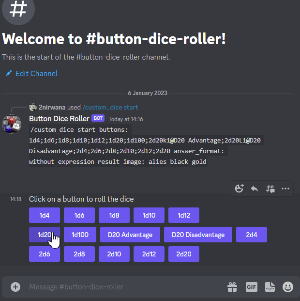
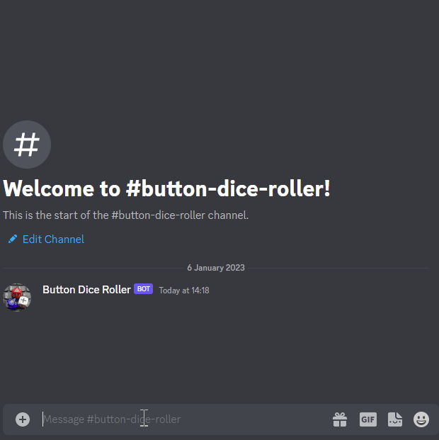
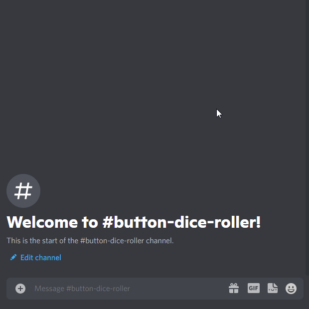
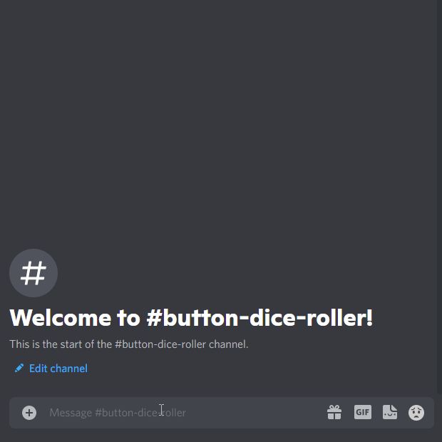
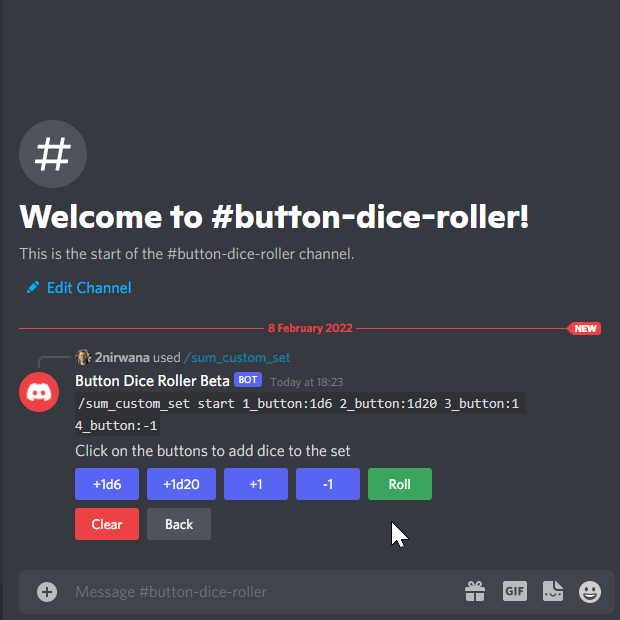
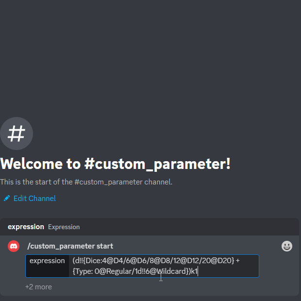

https://www.gnu.org/licenses/agpl-3.0[image:https://img.shields.io/badge/License-AGPL_v3-blue.svg[License: AGPL v3]] https://codecov.io/gh/twonirwana/DiscordDiceBot[image:https://codecov.io/gh/twonirwana/DiscordDiceBot/branch/main/graph/badge.svg?token=OLH7L312D7[codecov]]

== Button Dice Roller

This is dice rolling bot for Discord.
The bot needs to be configured with a slash command in a channel and then provides a message with a button selection.
Upon clicking on a button the bot will post the result and move the message with the buttons to the bottom of the channel.
If the message is pined, then it will only be copied and not moved.
This allows it to roll dice without typing commands and thereby improves usability, especially for touchscreen users.
The bot supports Discord thread (the button message must be added after the thread creation), Text in Voice and it is possible to send the answer in a different channel.

*Add to Discord channel by following this link*: https://discord.com/api/oauth2/authorize?client_id=812381127943782502&permissions=18432&scope=bot%20applications.commands[*Bot invite link*]

*Discord Server for trying the bot, questions and feature suggestions*: https://discord.gg/e43BsqKpFr[Button Dice Roller Discord Server]

*The bot need the following permission*:

* create application commands (which are needed to control the bot)
* send message (for the dice buttons and results)
* embed links (display of structured answers)

WARNING: *If you can’t see the bots messages*: The link preview in the discord setting must be activated to see the roll results

=== Example RPG System Commands

Some example for commands, many more systems can be mapped with commands, please see in the detail’s description below for further options

==== DnD 5e

`/custom_dice start buttons:1d4;1d6;1d8;1d10;1d12;1d20;1d100;2d20k1@D20 Advantage;2d20L1@D20 Disadvantage;2d4;2d6;2d8;2d10;2d12;2d20;3d4;3d6;3d8;3d10;3d12;3d20`

==== OSR

`/custom_dice start buttons:1d20@D20;1d6@D6;2d6@2D6;1d4@D4;1d8@D8;3d6,3d6,3d6,3d6,3d6,3d6@Stats;(3d6=)*10@Gold;1d100@D100;1d10@D10;1d12@D12`

==== Fate

`/fate start type:with_modifier`

==== World of Darkness

===== Chronicles of Darkness / nWoD

`/count_successes start dice_sides: 10 target_number: 8 reroll_set: 10`

===== Storyteller System / oWoD

`/pool_target start sides:10 max_dice:15 reroll_set:10 botch_set:1 reroll_variant:ask`

==== Shadowrun

`/count_successes start dice_sides:6 target_number:5 glitch:half_dice_one max_dice:20`

==== Traveller

`/sum_custom_set start buttons:+2d6;+(3d6k2)@Boon;+(3d6l2)@Bane;+1d6;+1;+2;+3;+4;-1;-2;-3;-4`

=== Commands

All button configurations can be used with the `target_channel` option.
If this option is used then the answer of a roll will be posted in the provided channel.
The target channel must be a text channel and need the bot need the usual permissions.
If a message sends the answer to another channel, it will not be moved to the end of its own channel.

==== Custom dice buttons

Use the slash command: `custom_dice start` and add up to 25 custom buttons, each with its own dice expression (see the section <<Dice Expression Notation>>).
The expressions for the buttons are seperated by `;`.
For example `/custom_dice start buttons:3d6@Attack;10d10;3d20` will produce three buttons, one with `3d6` (and the label ” Attack), one with `10d10` and one with `3d20`.
The old version of the command, with the old dice expression, can be still used with `custom_dice legacy_start`, which is not recommended.

Clicking on a button provides the results of the button dice expression.

==== Direct Roll

With the command `/r` it is possible to directly call the dice expression (see <<Dice Expression Notation>>) without the usage of buttons.
For example `/r 3d6' will simply roll 3d6 and post the result without showing any buttons.
The result of the dice will be summed up per default.

==== Count success in a pool

Use the slash command: `/count_successes start`.
You need to provide the sides of the dice, the target number, optional a glitch system as parameter and the number of buttons.
For example `/count_successes start dice_sides: 12 target_number: 7 glitch: half_dice_one max_dice: 10 min_dice_count: 2 reroll_set: 11,12 botch_set: 1,2,3` creates 10 (from 2d12 to 11d12) buttons for 12 sided dice that roll against the target of 7.
The dice side 11 and 12 will be rerolled and the result 1,2 or 3 will remove a success.
By clicking on a button a number of dice will be rolled and the count of the dice with results equal or approve the target number returned.

===== Glitch Option

As default there is no glitch option (special handling of ones) but it is possible to configure one of the following options:

====== half_dice_one

The option `half_dice_one` will mark the result as glitch if more than half of the dice show 1. This is for example used in the Shadowrun dice system.

====== count_ones

The option `count_ones` will only mark and count the ones in the result but will not change the number of successes.

===== Number of Dice

The optional parameter `max_dice` will change the max number of dice (and thereby the number of buttons).
The default value is 15, which will be used if the parameter is not set, and the max number of dice is 25.

===== Minimal dice count

The count successes command provides per default buttons for 1 to `max_dice` count dice buttons.
If `min_dice_count` is used then the bot will start with a higher number of dice.
For example `dice_sides: 6`, `dice_sides:max_dice: 5` and `min_dice_count: 10` will result in the buttons: 10d6, 11d6, 12d6, 13d6, 14d6

===== Reroll Set

The optional parameter `reroll_set` provide the sides of the die that should be rerolled.
Multiple numbers can be given comma seperated.

===== Botch Set

The optional parameter `botch_set` provide the sides of the die that negate successes.
Multiple numbers can be given comma seperated.

==== Fate

Use the slash command: `/fate start type:with_modifier` or `/fate start type:simple` to get buttons for Fate.
There are two types simple and with modifier.

==== Sum Dice Set

Use the slash command `/sum_dice_set start` to create a message to create a die set.
The user can click on the + and - buttons to add dice to the set.
Clicking on the `Roll` button will roll the dice the message and copy a clear button message to the end.

==== Hold Reroll

Use the slash command `/hold_reroll start sides:6 reroll_set:2,3,4 success_set:5,6 failure_set:1` to create a message for the hold reroll system.
The system has the following parameter:

* `sides`: The sides of the dice
* `reroll_set`: The number on the dice that can be rerolled.
Multiple numbers can be given comma seperated.
* `success_set`: The number on the dice that are counted as success.
Multiple numbers can be given comma seperated.
* `failure_set`: The number on the dice that are counted as failure.
Multiple numbers can be given comma seperated.

If the roll has numbers that are in the reroll set than the user has the option to reroll, finish or clear the result.

* Reroll will reroll all results in the reroll set and keep the remaining unchanged.
* Finish will fix the current result and allow a new roll.
* Clear will remove the current result and allow a new roll.

==== Pool Target

Use the command `/pool_target start sides:<sidesOfDie> max_dice:<maxDiceInPool> reroll_set:<numbersThatCanBeRerolled> botch_set:<numbersThatAreSubractedFromTheSuccesses> reroll_variant:<rerollVariant>` to create a message for the pool target system.
The system will first ask the user to select the pool size, then the target number and then, depending on the configuration, if dice should be rerolled.
Each dice result bigger or equal of the target number is a success.
If a botch set is configured then the number of dice results that are in the botch set will be subtracted from the successes.
If a reroll is configured then all dice results that are in the reroll set will rerolled and the new results added to total results.

The system has the following parameter:

* `sides`: The sides of the dice, e.g. 10 for a pool that uses d10.
* `max_dice`: The max number of dice in the pool, limited to and default is 15
* `reroll_set`: The number on the dice that can be rerolled.
Multiple numbers can be given comma seperated.
* `botch_set`: The number on the dice that remove successes.
Multiple numbers can be given comma seperated.
* `reroll_variant`: The default option `always` will always reroll all dice results in the reroll set.
The option `ask` will ask the user each time if the reroll should be done.

Please let me know if another system is needed.

==== Sum Custom Set

Use the slash command `/sum_custom_set start buttons:+1d6;+1d20;+1@Boon;-1@Bane` to create a message with a custom dice set.
In this case it will create four buttons: `1d6`,`1d20`,`+1@Boon` and `-1@Bane`.
The buttons can be created with the dice notation, see the section <<Dice Expression Notation>> and are seperated by `;`.
The text after an optional `@` will be used as label for the botton.
The user can click on a button to add it to the set, even multiple times.
The first user that clicks on a button add his name to the message and only this user can add, remove or roll dice.
Every user can still use the `Clear` button.
Clicking on the `Roll` button will roll the dice the message and copy a clear button message to the end.
The `Roll` can only be clicked if the expression is valid. `Back` will undo the last addition and `Clear` reset all.
If the option `always_sum_result` is true (the default) then the result of the dice will be added together, the equivalent of adding `=` at the end of the expression.

The old version of the command, with the old dice expression, can be still used with `sum_custom_set legacy_start`, which is not recommended.

==== Custom Parameter

Use for example the slash command `/custom_parameter expression:{numberOfDice:1<=>10}d{sides:4/6/8/10/12/20/100}` to create a message with a dice expression, where the user can fill the parameter with buttons.
For the dice expression see the section <<Dice Expression Notation>>.
The parameter have the format `+{name}+`.
If there is no range given, then button for the values 1-15 are presented.
There are two parameter range notations:

* `{numberOfDice:1<=>10}`: Provides the buttons for the given range (including).
The maximum are 23 buttons.
* `{sides:4/6/8/10/12/20/100}`: Provides each value, seperated be a slash up to 23 buttons.

The user can click on the buttons to fill all open parameter of the expression.
If all parameter are selected then the expression will be rolled.
The first user that clicks on a button add his name to the message and only this user can select further parameter.
Every user can still use the `Clear` button.

==== Clear Command

The clear command removes all button configuration in a channel from the bot and deletes the button messages.

=== Dice Expression Notation

see https://github.com/twonirwana/DiceEvaluator for more details.

=== Operators

[width="100%",cols="9%,8%,7%,48%,4%,8%,8%,8%",options="header",]
|===
|Name |Notation |Example |Description |Precedent |Associativity |Left parameter |Right parameter
|Sum |`<left> =` |`2d6=` |Sums the list of on the left side of the symbol |0 |left |a list |-
|Multiply |`<left> * <right>` |`2 * 6` |Multiplies the right number with the left number |1 |left |a single number |a single number
|Divide |`<left> / <right>` |`4 / 2` |Divides the right number with the left number |2 |left |a single number |a single number
|Count |`<list> c` |`3d6>3c` |Counts the number of elements in a list |3 |left |a list |-
|Greater Then Filter |`<list> > <number>` |`3d6>3` |Keeps only the elements of the left list that are bigger as the right number |4 |left |one or more numbers |a single number
|Lesser Then Filter |`<list> < <number>` |`3d6<3` |Keeps only the elements of the left list that are lesser as the right number |5 |left |one or more numbers |a single number
|Greater Equal Then Filter |`<list> >= <number>` |`3d6>=3` |Keeps only the elements of the left list that are bigger or equal as the right number |6 |left |one or more numbers |a single number
|Lesser Equal Then Filter |`<list> <= <number>` |`3d6<=3` |Keeps only the elements of the left list that are lesser or equal as the right number |7 |left |one or more numbers |a single number
|Keep Highest |`<list> k <numberToKept>` |`3d6k2` |keeps the the highest values out a list, like the roll of multiple dice |8 |left |one or more numbers |a single number
|Keep Lowest |`<list> l <numberToKept>` |`3d6l2` |keeps the the lowest values out a list, like the roll of multiple dice |9 |left |one or more numbers |a single number
|Appending |`<left> + <right>` |`2d6 + 2` or `+3` |Combines the rolls of both sides to a single list. If used as unary operator, it will be ignored e.g. `+5` will processed to `5` |10 (max for unary) |left for binary and right for unary |none or more value |one or more value
|Negative Appending |`<left> - <right>` |`2 - 1` or `-d6` |Combines the rolls of both sides to a single list. The right side is multiplied by -1. |11 |left for binary and right for unary |none or more value |one or more numbers
|Exploding Add Dice |`<numberOfDice>d!!<numberOfFaces>` |`3d!!6` |Throws dice and any time the max value of a die is rolled, that die is re-rolled and added to the die previous resul total. A roll of the reroll the sum of the value. |12 |left for binary and right for unary |none or a single number (max 1000) |a single number
|Exploding Dice |`<numberOfDice>d!<numberOfFaces>` |`4d!6` or `d!6` |Throws dice and any time the max value of a die is rolled, that die is re-rolled and added to the dice set total. A reroll will be represented as two dice roll values |13 |left for binary and right for unary |none or a single number (max 1000) |a single number
|Regular Dice |`<numberOfDice>d<numberOfFaces>` |`3d20`, `d20` or `3d[2/4/8]` |Throws a number of dice given by the left number. The number sides are given by the right number. If the right side a list, a element of the list is randomly picked. The roll is a list with the dice throw |14 |left for binary and right for unary |none or a single number (max 1000) |a single number or multiple values
|===

=== Functions

[width="100%",cols="6%,22%,14%,58%",options="header",]
|===
|Name |Notation |Example |Description
|color |`color(<expression>, <'color'>)` |`color(4d6,'red')` |marks the elements of one inner expression with a text. All other operators will not combine elements of different colors.
|min |`min(<expression1>, <expression2> ...)` |`min(4d6)` |returns the smallest elements (multiple if the smallest is not unique) of one or more inner expressions. Text is compared alphabetically
|max |`max(<expression1>, <expression2> ...)` |`max(4d6)` |returns the smallest elements (multiple if the smallest is not unique) of one or more inner expressions. Text is compared alphabetically
|sort asc |`asc(<expression1>, <expression2> ...)` |`asc(4d6)` |sorts all elements ascending of one or more inner expressions. Text is compared alphabetically
|sort desc |`desc(<expression1>, <expression2> ...)` |`desc(4d6)` |sorts all elements descending of one or more inner expressions. Text is compared alphabetically
|sort desc |`desc(<expression1>, <expression2> ...)` |`desc(4d6)` |sorts all elements descending of one or more inner expressions. Text is compared alphabetically
|chancel |`chancel(<expression>, listA, listB)` |`chancel(8d10, 10, 1)` |the elements of listA and listB (can also be single elements) chancel each other.
|double |`double(<expression>, list)` |`double(8d10,10)` |every element in the expression that is equal a element in the list will be duplicated
|if equal |`ifE(<expression>,<expression>,<true>,<false>)` |`ifE(1d6,6,'six','no six')` |compares the elements of two `<expression>` and if they are equal return the `<true>` expression or else the `<false>` expression
|if greater |`ifG(<expression>,<expression>,<true>,<false>)` |`ifG(1d6,4,'5 or 6','less')` |compares the elements of two `<expression>` and if the left is greater than the right then return the `<true>` expression or else the `<false>` expression. Both expression need to produce a single number
|if lesser |`ifL(<expression>,<expression>,<true>,<false>)` |`ifL(1d6,3,'1 or 2','more')` |compares the elements of two `<expression>` and if the left is lesser than the right then return the `<true>` expression or else the `<false>` expression. Both expression need to produce a single number
|group count |`groupC(<expression1>, <expression2> ...)` |`groupC(20d6)` | counts all elements of with the same value and provides the results as list in the format of `<count>x<value>`
|===
