= Button Dice Roller
:toc: macro

https://www.gnu.org/licenses/agpl-3.0[image:https://img.shields.io/badge/License-AGPL_v3-blue.svg[License: AGPL v3]] https://codecov.io/gh/twonirwana/DiscordDiceBot[image:https://codecov.io/gh/twonirwana/DiscordDiceBot/branch/main/graph/badge.svg?token=OLH7L312D7[codecov]]
image:https://img.shields.io/github/actions/workflow/status/twonirwana/DiscordDiceBot/codeCov.yml?branch=main[GitHub Workflow Status]
image:https://img.shields.io/discord/898657305883725834[link="https://discord.gg/e43BsqKpFr"]
image:https://dcbadge.limes.pink/api/shield/812381127943782502?bot=true&style=flat&theme=clean-inverted[link="https://discord.com/api/oauth2/authorize?client_id=812381127943782502&permissions=274878023680&scope=applications.commands%20bot"]

This bot is for rolling dice in discord.
The bot needs to be configured with a slash command in a channel and then provides a message with buttons.
Upon clicking on a button the bot will roll the stored dice expression for the button, post the result and move the message with the buttons to the bottom of the channel.
If the message is pined, then it will only be copied and not moved.
This allows user to roll dice without typing commands and thereby improves usability, especially for touchscreen users.
The bot supports Discord thread (the button message must be added after the thread creation), forum, Text in Voice, direct messages, and it is possible to send the answer in a different channel.
It can provide images of the dice roll results and it is possible to configure channel or user specific aliases.

image:image/example.webp[image]

*Add to Discord channel by following this link*: https://discord.com/api/oauth2/authorize?client_id=812381127943782502&permissions=274878023680&scope=applications.commands%20bot[*Bot invite link*]

*Discord Server for trying the bot, questions and feature suggestions*: https://discord.gg/e43BsqKpFr[Button Dice Roller Discord Server]

*The bot need the following permission*:

* create application commands (which are needed to control the bot)
* send message and send message in threads (for the dice buttons and results)
* embed links (display of structured answers)
* attach files (add images with the dice result)
* read message history (to detect if a button message was pinned)

toc::[]

== Known Problems

*If you can’t see the bots messages*: The link preview in the discord setting must be activated to see the roll results

*If you can’t use slash commands*: Disable User Settings > Accessibility > Use the legacy chat input

== Quickstart

The bot has list a ready to play list of presets for many RPG systems.
Simple select a system out of the list or keep typing to search and filter in the list.
All these presets are realised with the user available commands and dice expression and can be adapted and extended.
Please let me know if you have a good new preset or an improved version for an existing preset.
The quickstart will show a user also all named commands other user have created at the same server and all named commands the user himself has created in any server.

[cols="1,1"]
|===
|`A Song of Ice and Fire`
|`Blades in the Dark`
|`Blades in the Dark - Detail`
|`Blades in the Dark without Dice Images`
|`Bluebeard's Bride`
|`Call of Cthulhu 7th Edition`
|`Candela Obscura`
|`Candela Obscura v2`
|`City of Mist`
|`Coin Toss`
|`Cyberpunk Red`
|`Dice Calculator`
|`Dungeon & Dragons 5e`
|`Dungeon & Dragons 5e Calculator`
|`Dungeon & Dragons 5e Calculator 2`
|`Dungeon & Dragons 5e without Dice Images`
|`Dungeon Crawl Classics`
|`EZD6`
|`Exalted 3ed`
|`Fallout`
|`Fate`
|`Fate without Dice Images`
|`Forbidden Lands`
|`Heroes of Cerulea`
|`Hunter 5ed`
|`Ironsworn`
|`Kids on Brooms`
|`OSR`
|`Oathsworn`
|`One-Roll Engine`
|`Paranoia: Red Clearance Edition`
|`Powered by the Apocalypse`
|`Prowlers & Paragons Ultimate Edition`
|`Public Access`
|`Rebellion Unplugged`
|`Risus The Anything RPG "Evens Up"`
|`Rêve de Dragon`
|`Salvage Union BDR-V1.0`
|`Savage Worlds`
|`Shadowdark`
|`Shadowrun`
|`Shadowrun without Dice Images`
|`Star Wars - West End Games D6 Rules, 2nd Edition REUP`
|`The Expanse`
|`The Marvel Multiverse Role-Playing Game`
|`The One Ring`
|`Tiny D6`
|`Traveller`
|`Vampire 5ed`
|`Year Zero Engine: Alien`
|`nWod / Chronicles of Darkness`
|`oWod / Storyteller System`
|
|===

The quickstart command can also set alias to make direct rolls more comfortable.
You can also set channel config default for the answer format to `without_expression` to hide the complex expression in the answers.
See <<_channel_config>> for channel config

[cols="1,1"]
|===
| Alias Name  | Alias Function

|`Cyberpunk Red - Alias` | roll with `cp`
|`Dungeon & Dragons 5e - Alias` | roll advantage with `adv` and disadvantage with `dis`
|`Fate - Alias` | roll four fate dice with `4dF`
|`nWod / Chronicles of Darkness - Alias` | roll with `w` e.g. `8w`
|`oWod / Storyteller System - Alias` | roll with `r` e.g. `8r6` for 8 dice against target 6 and `re` for rolling with rerolling on 10
|`Shadowrun - Alias` |  roll with `sr` e.g `8sr`
|`Savage Worlds - Alias` | roll exploding dice with `r` e.g. `r10` for an exploding d10 and `sw` for a roll with wildcard dice e.g. `sw8`
|`Blades in the Dark - Alias` | roll with `b` e.g. `4b` for 4 dice
|===

== Options

=== Language

The bot supports multiple languages (currently English, German, Brazilian Portuguese and French).
The bot will use the discord client language for the slash command and options.
Each button message has a language configuration and will return its answers always in the language of its configuration.
All existing button messages are default in English.
Button messages are per default created in the language of the discord client but that can be overwritten with the `language` option of the slash commands.
The direct roll messages are using the language that is configured with the `channel_config` command and not the discord client language.
The dice expressions are currently not translated.
Contributions of additional language and improvements are very welcome.

=== Target Channel

All button configurations can be used with the `target_channel` option.
If this option is used then the answer of a roll will be posted in the provided channel.
The target channel must be a text channel and need the bot need the usual permissions.
If a message sends the answer to another channel, it will not be moved to the end of its own channel.

=== Answer Format

It is possible to create line breaks in expression results (not in the button labels).
For adding a line break add `\n` in the text.

For example `/custom_dice start buttons: '\n  Attack: ' _ 1d20 + 10= _ '\n  Damage: ' _ 2d6+3= @Attack&Damage answer_format: without_expression` produces the following result:

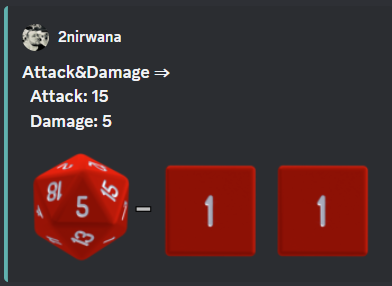

All commands have an `answer_format` option that determines how the answer of a dice roll is shown.
In the case of the direct roll command `r` the `answer_format` can be configured for the current channel with the `channel_config` command.
There are the following options: `full`, `without_expression`, `only_result`, `only_dice`, `compact` and `minimal`.

==== Full

`full` is the default and shows result as multiline with avatar of the user, color coding and all details.
Will show result images, if they are configured.

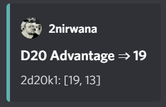

==== Without expression

`without_expression` is the same as `full` but don't show the dice expression in the result.
This is useful if the expression is very long and it is recommended to add a label.
Will show result images, if they are configured.

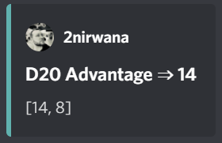

==== Only Result

`only_result` shows only the calculated result and if configured the dice images.
The expression, static modifier and the dice results as text will not be shown.
This option is useful for buttons that only produce a text or emoji

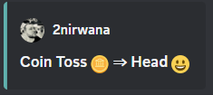

==== Only Dice

`only_dice` shows only dice results, if configured as images.
The expression, static modifier and calculated results beside the dice will not be shown.

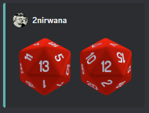

==== Compact

`compact` shows the result as single line (if there are multiple expressions in on roll, they will be displayed in multiple lines) and all details.
Will not show result images, even if they are configured.

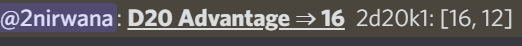

==== Minimal

`minimal` shows the result as single line with only the expression (or if available the label instate of the expression) and result, without the details like the result of each die.
Will not show result images, even if they are configured.

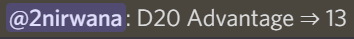

=== Dice Images

All commands have a `dice_image_style` and a `dice_image_color` option that can be configured to add an image of the rolled dice.
To configure dice images for the direct roll, use the `/channel_config save_direct_roll_config` command.
The color of specific dice can be overwritten, with valid colors for the style, in the expression.
For example:

`/custom_dice start buttons: 2d6+2d10 col 'red_and_gold' + 2d20 col 'green_and_gold'@color roll answer_format: without_expression dice_image_style: polyhedral_alies_v2 dice_image_color: blue_and_gold`

produces:

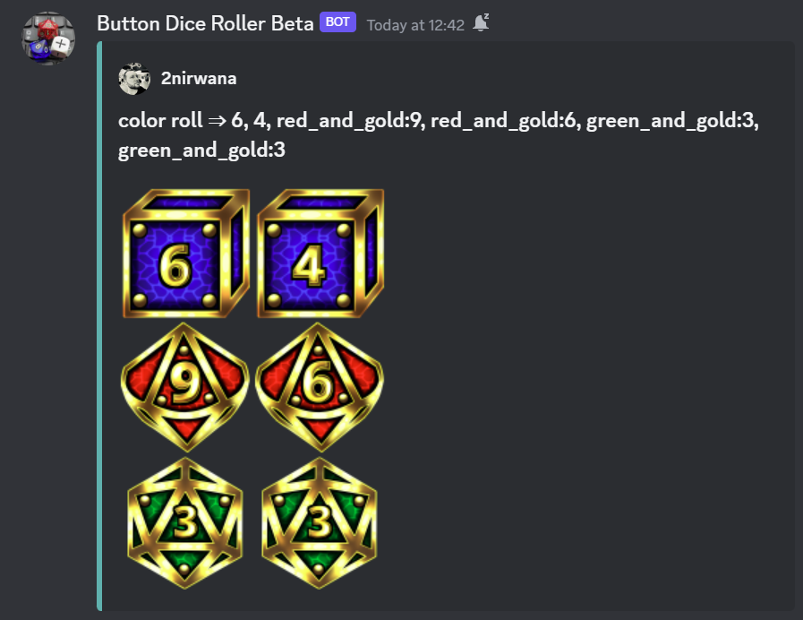

For the direct rolls it can be configured with the `channel_config` command.
The images will only be shown if the following conditions are met:

* The `answer_format` is set to `full`, `only_dice`, `only_result` or `without_expression`
* No set of dice with more than 30 dice
* If the color of the dice is not `none`

There are the following options:

==== none

No image will be shown.

==== polyhedral_3d

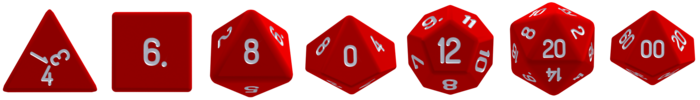

image:image/polyhedral_3d_purple_and_white.png[image,600]
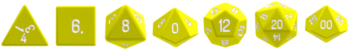

Valid for d4, d6, d10, d8, d12, d20, d100 and the supported colors are: `red_and_white`, `blue_and_white`,`green_and_white`, `grey_and_white`, `orange_and_white`, `purple_and_white`, `yellow_and_white`.

==== fate

Valid for d[-1,1,1] and the only supported color is: `black`

==== d6_dots

.white

.black_and_gold

Valid for d6 and the supported color are: `white` and `black_and_gold`

The by `black_and_gold` was adapted from https://speakthesky.itch.io/typeface-dicier[Dicier].

==== polyhedral_2d

Valid for d2, d4, d6, d10, d8, d12, d20, d100 and the supported colors are: `white`, `gray`, `black`, `red`, `pink`, `orange`, `yellow`, `green`, `magenta`, `cyan`, `blue` and `indigo`.

It `polyhedral_2d` also works with custom dice and emojis.
With the limitation that it will only create images if for one or two regular characters or for one emoji.

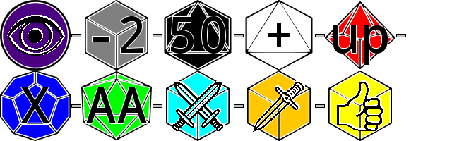

A visual coin throw example is: `/custom_dice start buttons: d[👍/👎]@Coin answer_format: only_dice dice_image_style: polyhedral_2d dice_image_color: gray`

==== polyhedral_alies_v1

Valid for d4, d6, d10, d8, d12, d20, d100 and the only supported color is: `black_and_gold`
This set was designed and contributed by https://www.instagram.com/alie_in_beanland/[alieinbeanland].

==== polyhedral_alies_v2

Valid for d4, d6, d10, d8, d12, d20, d100 and supported colors are: `black_and_gold`, `blue_and_silver`, `blue_and_gold`, `green_and_gold`, `orange_and_silver`, `red_and_gold`, `purple_and_silver`, `black_and_red`, `rainbow`, `black_and_silver`, `pink_and_silver`, `yellow_and_brown`, `purple_and_black`, `blue_and_black`

.black_and_gold

.blue_and_silver

.green_and_gold

.red_and_gold

.blue_and_gold

.orange_and_silver

.purple_and_silver

.black_and_red

.rainbow

.black_and_silver

.pink_and_silver

.yellow_and_brown

.purple_and_black

.blue_and_black

This set was designed and contributed by https://www.instagram.com/alie_in_beanland/[alieinbeanland].

==== polyhedral_knots

.blue

.purple_dark

.purple_white

Valid for d4, d6, d10, d8, d12, d20, d100 and the supported color is: `blue`, `purple_dark` and `purple_white`

This set was designed and contributed by mailto:minuette@gmail.com[Myrynvalona].

==== polyhedral_RdD

.default
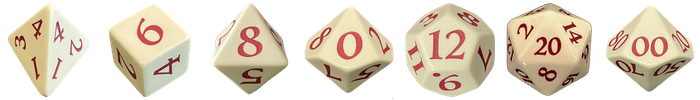

.special
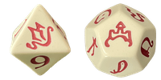

The style has two "colors": `default` and `special`.
The `default` "color" contains universal images for d4, d6, d7, d10, d8, d12, d20, d100.
The `special` "color" contains only images for Draconic d8 (image values are 0 to 7 and a dragon for the 8) and Astral d12 with only special symbols.

This set was designed and contributed by http://scriptarium.org[scriptarium.org].

==== Expanse

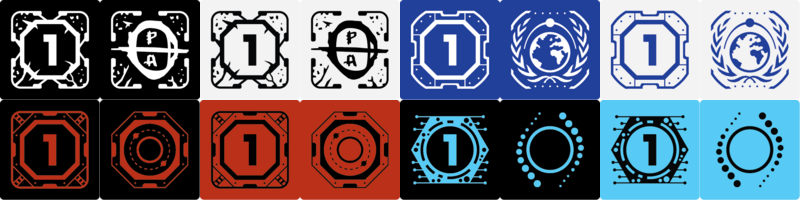

Valid for d6 and the supported color are: `belt_dark`, `belt_light`, `earth_dark`, `earth_light`, `mars_dark`, `mars_light`, and `protogen_light`.

The dice image are from https://github.com/Foxfyre/expanse.

==== Marvel

Valid for d6 and the supported color are: `red` and `blue`.

The dice image are from SeaGoatGames

==== Marvel V2

Valid for d6 and the supported color are: `red` and `white`.

The dice image created by TheRedSoup

=== Answer Interaction

Answer interaction option allow to change/interact with the result of a roll.
Default is `none`.

==== reroll

The `reroll` option allows the user of the original roll to reroll some or all of the dice.
The user can select up to 20 dice for reroll and reroll them.
All not selected dice keep there result.
This supports all dice expression functionality.
If for example an exploded die is rerolled then it will also remove the exploded results.
The reroll can be done multiple times, until the 'Finish' button is used.

=== Emoji Button

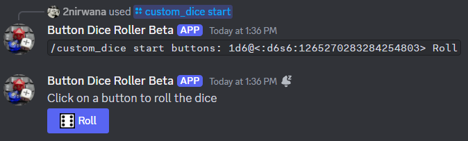

If a command creates a button with a label (usually the text after the `@`) then it is possible to give the button an emoji.
It musst be a single emoji at the start of the label.
It can be a unicode emoji or a custom discord emoji (provided with emoji selection button, on the right side of the message input).
Commands with invalid emojis will fail and simply produce no button message.

=== Name

Commands can be given names.
Named commands can be recreated with the `quickstart` command or reused with the `starter` command.

== Commands

=== Custom Dice

image:image/custom_dice.webp[image]

Use the slash command: `custom_dice start` and add up to 25 custom buttons, each with its own dice expression (see the section <<Dice Expression Notation>>).
The expressions for the buttons are seperated by `;`.
Using `;;` will create a row break and put the button after `;;` in a new row.
Discord allows a maximum of 5 rows with each 5 buttons.
For example `/custom_dice start buttons:3d6@Attack;10d10;3d20` will produce three buttons, one with `3d6` (and the label Attack), one with `10d10` and one with `3d20`.
Clicking on a button provides the results of the button dice expression.

It is possible to use alias with custom dice buttons.
The alias must be created before the button is created.
A usage example would be:
Create the server alias `attack modifier` with the value 0.
Then create a custom dice button with the expression `d20+attack modifier@Attack` and each player create a user alias for `attack modifier` with the attack modifier of its character.
This will provide a button called `Attack` which rolls with a personalized modifier for each player.

==== Examples

===== Dungeon & Dragons 5e with Dice Images

`/custom_dice start buttons: 2d20k1@D20 Advantage;2d20L1@D20 Disadvantage;D20;;1d4;1d6;1d8;1d10;1d12;1d100;2d4=@2d4;2d6=@2d6;2d8=@2d8;2d10=@2d10;2d12=@2d12;2d20=@2d20 answer_format: without_expression dice_image_style: polyhedral_RdD dice_image_color: default`

===== Powered by the Apocalypse

`/custom_dice start buttons: val('$roll',2d6=) if('$roll'>=?10, 'Total Success', '$roll'\<=?6, 'Miss', 'Partial Success')@Move;;val('$roll',2d6+1=) if('$roll'>=?10, 'Total Success', '$roll'\<=?6, 'Miss', 'Partial Success')@Move +1;val('$roll',2d6+2=) if('$roll'>=?10, 'Total Success', '$roll'\<=?6, 'Miss', 'Partial Success')@Move +2;val('$roll',2d6+3=) if('$roll'>=?10, 'Total Success', '$roll'\<=?6, 'Miss', 'Partial Success')@Move +3;val('$roll',2d6+4=) if('$roll'>=?10, 'Total Success', '$roll'\<=?6, 'Miss', 'Partial Success')@Move +4;val('$roll',2d6+5=) if('$roll'>=?10, 'Total Success', '$roll'\<=?6, 'Miss', 'Partial Success')@Move +5;;val('$roll',2d6-1=) if('$roll'>=?10, 'Total Success', '$roll'\<=?6, 'Miss', 'Partial Success')@Move -1;val('$roll',2d6-2=) if('$roll'>=?10, 'Total Success', '$roll'\<=?6, 'Miss', 'Partial Success')@Move -2;val('$roll',2d6-3=) if('$roll'>=?10, 'Total Success', '$roll'\<=?6, 'Miss', 'Partial Success')@Move -3;val('$roll',2d6-4=) if('$roll'>=?10, 'Total Success', '$roll'\<=?6, 'Miss', 'Partial Success')@Move -4;val('$roll',2d6-5=) if('$roll'>=?10, 'Total Success', '$roll'\<=?6, 'Miss', 'Partial Success')@Move -5;;d4;d6;d8;d10;d12;d20 answer_format: without_expression dice_image_style: polyhedral_RdD dice_image_color: default`

===== Call of Cthulhu 7th Edition

`/custom_dice start buttons: 1d100; 2d100L1@1d100 Advantage; 2d100K1@1d100 Penalty; 1d3; 1d4; 1d6; 1d8; 1d10; 1d12; 1d20; 3d6`

===== OSR

`/custom_dice start buttons:1d20@D20;1d6@D6;2d6@2D6;1d4@D4;1d8@D8;6x3d6=@Stats;(3d6=)*10@Gold;1d100@D100;1d10@D10;1d12@D12`

=== Custom Parameter

image:image/custom_parameter.webp[image]

Use for example the slash command `/custom_parameter expression:{numberOfDice:1\<\=>10}d{sides:4@D4/6@D6/8@D8/12@D12/20@D20}` to create a message with a dice expression, where the user can fill the parameter with buttons.
The user can click on the buttons to fill all open parameter from left to right.
When all parameter are selected then the expression will be rolled.
The first user that clicks on a button add his name to the message and only this user can select further parameter.
Every user can still use the `Clear` button.
For the dice expression see the section <<Dice Expression Notation>>.
The parameter have the format `+{name}+`.
If there is no range given, then button for the values 1-15 are presented.
There are two parameter range notations:

* `{numberOfDice:1\<\=>10}`: Provides the buttons for the given range (including).
The maximum are 23 buttons.
* `{sides:4/6/8/10/12/20}`: Provides each value, seperated be a slash up to 23 buttons.
It is possible to add an optional label to each value in the format `value@label`.
For example `{bonus:0@None/3@Small Bonus/5@Big Bonus}` will show on the buttons 'None', 'Small Bonus' and 'Big Bonus' but apply the values 0, 3 or 5 to the expression

If the label of a parameter option starts with a `!` e.g. `{sides:1d6@default/2d6@bonus/d20@!direct}` then the button is as a green direct roll button.
This means that if it is clicked then all following parameter will be skipped and in the expression replaced with `''`.

For example:
`/custom_parameter start expression: +{n}+d{s:4/6/10/20@!20}+{modi:+1/+2/+3}=` let you select first the number of die, then the type of dice and then a modification.
But if you select `20` it will skip the modification selection and directly roll the selected number of d20.

It is possible to skip parameter if specific buttons are selected.
It is possible to give a parameter and a slash parameter options a path ID.
The id is set by adding a number or word surrounded by `!` at the end of the parameter name or the slash option.
If an option is selected that has a path ID then all following parameter that don't match the path ID are skipped.
All skipped parameter will be removed from the expression, that means replaced with an empty string.

For example:
`/custom_parameter start expression: val('$n',{numberOfDice:1\<\=>10}),{type:''!1!@pool/''!2!@sum/''!3!@simple} + '$n' d10{target!1!:>=4c@4/>=6c@6/>=8c@8}{modifier!2!:+1=@+1/+2=@+2/+3=@+3}` let you select first the number of die, then if you want to roll a pool test against a target number, sum all dice together with a modifier or make a simple roll without any logic.

An expression can have up to 4 parameter.
The command uses the `without_expression` as default answer format.

This command can also use alias (see the `channel_config` command).
The substitution of the alias name with its value happen upon pressing last button.
The alias must be created before the custom_parameter command is used and removing the alias can break existing button messages.

==== Examples

=====  nWod / Chronicles of Darkness

`/custom_parameter start expression: {Number of Dice}d!10>=8c`

=====  oWod / Storyteller System

`/custom_parameter start expression:val('$diceNumber',{Number of Dice}) val('$target', {Target Number:2\<\=>10}) val('$reroll', {Reroll on 10:0@No/1@Yes}) val('$roll', if('$reroll'=?0, '$diceNumber' d10,'$diceNumber' d!10)) ('$roll'>='$target' c) - ('$roll'==1c)=`

=====  Shadowrun

`/custom_parameter start expression: val('$roll',{number of dice:1\<\=>20} d6) concat('$roll'>4c, if('$roll'==1c >? '$roll' c/2,' - Glitch!'))`

=====  Savage Worlds:

`/custom_parameter start expression: (d!!{Dice:4@D4/6@D6/8@D8/12@D12/20@D20} + {Type: 0@Regular/1d!!6@Wildcard})k1`

=== Sum Custom Set

image:image/sum_custom_set.webp[image]

Use the slash command `/sum_custom_set start buttons:+1d6;+1d20;+1@Boon;-1@Bane` to create a message with a custom dice set.
In this case it will create four buttons: `1d6`,`1d20`,`+1@Boon` and `-1@Bane`.
The user can click on a button to add it to the set, even multiple times.
The first user that clicks on a button add his name to the message and only this user can add, remove or roll dice.
Every user can still use the `Clear` button.
Clicking on the `Roll` button will roll the dice the message and copy a clear button message to the end.
The `Roll` can only be clicked if the expression is valid. `Back` will undo the last addition and `Clear` reset all.

The buttons can be created with the dice notation, see the section <<Dice Expression Notation>> and are seperated by `;`.
Using `;;` will create a row break and put the button after `;;` in a new row.
If the buttons expression ends with `;;` then the three system buttons (Roll, Clear and Back) will be in a new row.
Discord allows a maximum of 5 rows with each 5 buttons.
The text after an optional `@` will be used as label for the button.

If the label starts with a `!` e.g. `d20@!d20` then the button is as a green direct roll button.
This means that if it is clicked then its value will be added to the expression and the roll is directly triggered and it is not necessary to click additionally on the `Roll` button.
Direct roll buttons are only enabled if the resulting expression is valid.

If the option `always_sum_result` is `true` (the default) then the result of the dice will be added together, the equivalent of adding `=` at the end of the expression.

If the option `hide_expression` is `true` (the default) then the result and the message with the current expression will show the label of the buttons and the expression only if the button has now specific label.
If it is set to `false` then it will show always the expression.

The optional option `prefix` and `postfix` will always add before/after the expression before it is rolled.
For example for the command `/sum_custom_set start buttons: +1d6;+2d6;+3d6 prefix: ( postfix: )k2` the following buttons are pressed: `+2d6`,`+3d6` and `Roll` then the expression `(+2d6+3d6)k2` will be generated and rolled.
If the combination of pressed button, the prefix and postfix is not a valid expression then the `Roll` button is disabled.

This command can also use alias (see the `channel_config` command).
The substitution of the alias name with its value happen upon pressing the `Roll` button.
If there is no valid alias then the expression can be invalid and it is not possible to press the `Roll` button.

==== Examples

===== Traveller

`/sum_custom_set start buttons:+2d6;+(3d6k2)@Boon;+(3d6l2)@Bane;+1d6;+1;+2;+3;+4;-1;-2;-3;-4`

===== Universal Dice Calculator

`/sum_custom_set start buttons: 7;8;9;+;-;4;5;6;d;k;1;2;3;0;l always_sum_result: true`

===== D&D 5th Dice Calculator

`/sum_custom_set start buttons: \+1d4;+1d6;+1d8;+1d10;+1d12;+1d100@%;+1d20@d20;+((2d20k1) col 'blue_and_gold')@ADV;+((2d20L1) col 'red_and_gold')@DIS;+((3d20k1) col 'blue_and_gold')@ACC;+1;+2;+3;+4;+5;-1;-2;-3;-4;-5;+10;-10 always_sum_result: true hide_expression_in_answer: true answer_format: without_expression dice_image_style: polyhedral_alies_v2 dice_image_color: blue_and_silver`

=== Direct Roll

image:image/direct_roll.webp[image]

With the command `/r` it is possible to directly call the dice expression (see <<Dice Expression Notation>>) without the usage of buttons.
For example `/r expression:3d6` will simply roll 3d6 and post the result without showing any buttons.
It is possible to give the roll a label by adding it with a `@`.

For example `/r expression:d20+10@Alriks Attack` will result in:

image:image/directRoll_label.png[image]

The result of the dice will be summed up per default.
The output can be configured with the `channel_config` command.

=== Alias Roll

Alias Roll, used with the command `/a`, is variant of the direct roll which shows the list of available alias in the autocomplete.
For example if you use first `/channel_config alias save name: heavy_orc_attack value: 1d20+6=@Heavy Orc Attack scope: current_user_in_this_channel` and then `/a alias_or_expression:`, then `heavy_orc_attack` will be in the autocomplete of the command.
It is still possible roll normal dice expression or extend the alias.
Alias can be added and removed with the `/channel_config alias` command.

=== Hidden Direct Roll

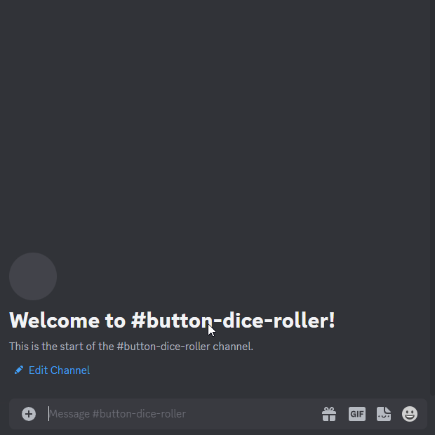

With the command `/h` it is possible to directly call the dice expression (see <<Dice Expression Notation>>) like <<Direct Roll>> but the answer is initial only visible to the user and can be revealed to other user by pressing on the button "Reveal".
For example `/h expression:3d6` will simply roll 3d6 and show only the current user the result.
The result of the dice will be summed up per default.
The output can be configured with the `channel_config` command.

[#_channel_config]
=== Channel Config

This command is used create a channel specific configuration.
It is possible to configure alias and the output for the direct rolls:

==== Direct Roll Config

The command can be configured for a channel by using the `/channel_config save_direct_roll_config` command.
The configuration will be used for all `/r` in this channel until it is overwritten or deleted with `/channel_config delete_direct_roll_config`.

There are the following options:

* `answer_format`: see the  <<Answer Format>> for details, the default value is `full`.
* `always_sum_result`: if the result should always sum together.
If set to false the `3d6` would return the result for each die, not the sum of all three.
This can still be done by using the sum operator `=` e.g. `3d6=`.
The default value is true
* `image_result`: see <<Dice Images>> for details, the default value is `polyhedral_3d_red_and_white`

==== Aliases

It is possible to configure alias in a channel.
Alias can be used with direct roll, sum_custom_set and custom_dice.
If a button is created that should use an alias, the alias musst exist before the button is created.

For example `/channel_config alias save name: att value: (2d20k1)+10+1d4 scope: current_user_in_this_channel` creates an attack alias for the user.
Each time the user uses the slash command `/r expression: att`, the `att` will automatically replaced with `(2d20k1)+10+1d4`

An alias has a name and a value and will replace each occurrence in the dice expression of its name with its value.

WARNING: Alias can influence each other and this can break the logic

There are two type of alias:

===== Replace

Replace alias simply search the name of the alias in the input and replace it with the value

===== Regex

Regex alias can be used to make a grouped match and replace.
For example will the alias with the name: `(?<numberOfDice>\d+) wod (?<target>\d+)` and the value: `${numberOfDice}d10>=${target}c` transform the input `8 wod 7` to `8d10>=7c`.
The best way to test your regex expression is with sites like https://regex101.com/

WARNING: If you use regex named groups you can't use `$` in other parts of the expression

===== Scope

There are two scopes of alias:

* `all_users_in_this_channel`: It will be applied to each roll in a channel, for every user.
* `current_user_in_this_channel`: It will only apply to for the user who created the alias in the channel.

The user specific alias will be applied first.

===== Commands

There are five commands

* `save` creates or overwrites an alias
* `multi_save` creates or overwrites multiple alias.
Alias are seperated by `;` and the name and the value are seperated by `:` for replace alias and `::` for regex alias.
For example: `/channel_config alias multi_save aliases: att:2d20;dmg:2d6+4= scope: current_user_in_this_channel` saves two alias:
** `att` with `2d20`
** `dmg` with `2d6+4=`
* `delete` removes an alias by its name
* `delete_all` removes all aliases
* `list` provides a list of all alias

=== Starter

Starter creates a wrapper command, that allows it to switch between multiple commands or recreate commands with a click on the button.
The user can add 1 to 10 named commands (created by him self in any server, by another user in the same server or one of the commands defined in quickstart).
In the resulting message, the user musst then first select one of the named commands, use it to create a roll and then message will reset to the selection named commands.

If the option `open_in_new_message: true` is set or the command is pinned, then it will not transform itself in the named command but create a new command message, as if it was created with the slash command.

The option `message` allows it to set a custom message.

=== Fetch

The command moves the last existing button message to the bottom of the channel.
The message must be at least 1min old.
The state of the button message will be lost and reset as if new created.

=== Clear

The clear command removes all button configuration in a channel from the bot and deletes the button messages.
The optional `name` option can be used to only delete a named command in a channel.

=== Validation

This command can be used to develop new expressions and get a fast feedback if the expression has the correct syntax.
Upon typing the autocomplete will be open and show the typed expression if it has a valid syntax and can be executed.
If the expression is invalid it will show the first 100 characters of the error message.
To get the complete error message press enter twice (even if the autocomplete will replace the expression with the error text).
The autocomplete validation will not apply alias.
This command will change when discord improves the autocomplete.

== Dice Expression Notation

see https://github.com/twonirwana/DiceEvaluator for all details.

The evaluator processes dice expression and returns a list of rolls, each containing a list of elements.
Elements have a value (a number or a text) and can have a color.
For example `2d6` rolls two six-sided dice and returns a list with two elements, each with a value between 1 and 6. To get the sum of the roll, simple add a `=` at the end, for example in this case `2d6=`.
The same applies to numbers `3 + 5` has as result a list with the elements 3 and 5, only if written as `3 + 5=` the result is 8.
All non-functional text must be surrounded (escaped) by `'`. For example `1d('head' + 'tail')` will flip a coin.
List can be included into the expression by using square brackets.
An empty list `[]` or empty literal `''` are non value.
For example `1d[2,2,4,4,6,6]` will a die which has two sides with 2, two sides with 4 and two sides with 6. The roll will be a list with one element, which has a value of 2, 4 or 6. Lists also escape characters, so `1d[head,tail]` will also flip a coin.

Multiple expression can be separated by `,`.
For example `3d6, 4d8` will roll two six-sided dice and return a list with two rolls, the first one containing the roll elements of the `3d6` and the second one the roll of the `4d8`.

Operators have a precedent, which is defined by the order of the operators in the table below.
Operators with a higher precedence are evaluated first.
Brackets can be used to change the order of evaluation.
For example `1d4+3d6` is the appending of roll of 1d4 and 3d6, but `(1d4+3=)d6)` gets first the sum of the roll of 1d4 and 3 and then rolls this number of d6.

The number of dice is limited to 1000 and every number approve 9 digits or with more than 9 digit after the decimal dot result in an error.

Boolean values will be represented by `'true'` (or `1`) and `'false'` (or `0`) .

It is possible to set tags and color.
Colors have no direct effect and will be also set to all random elements of the expression.
Tags on the other hand wil change the interaction of with other operators, in most cases operators will work only on elements with the same tag.

=== Operators

All operators are case insensitiv.

[width="100%",cols="9%,8%,7%,48%,4%,8%,8%,8%",options="header",]
|===
|Name |Notation |Example |Description |Precedent |Associativity |Left parameter |Right parameter
|Repeat |`<number>x<expression>` |`3x2d6` |Repeats the expression separately a number of times given in <number>. This should be used outside other expressions and will not work inside most expressions |0 |left |a single integer number between 1-10 | a expression
|List Repeat |`<number>r<expression>` |`3r(2d6=)` |Repeats the expression a number of times given in <number> and combines the results in one list. |1 |left |a single integer number between 0-20 | a expression
| Concat |`<expression>_<expression>` |`d20_'dmg''` | Combines the result of both expression into on single element |2 |left |one or more elements | one or more elements
|Or |`<boolean>\|\|<boolean>` |`d6=?5 \|\| d6=?6` | Boolean or operation of the two boolean values | 3 |left | boolean value | boolean value
|And |`<boolean>&&<boolean>` |`d6=?5 && d6=?6` | Boolean and operation of the two boolean values | 4 |left | boolean value | boolean value
|Not |`!<boolean>` |`!d6=?5` | Negates the boolean value right from it | 5 |right |  | boolean value
|Equal |`<left> =? <right>` |`d6=?5` | Compare the left and the right and returns true if equal and false otherwise | 6 |left |one or more elements  | one or more elements
|Lesser |`<left> <? <right>` |`d6<?5` | Compare the left and the right and returns true if `<left>` is lesser than `<right>` otherwise false | 7 |left |a single number | a single number
|Lesser Equal |`<left> \<=? <right>` |`d6\<=?5` | Compare the left and the right and returns true if `<left>` is lesser or equal then `<right>` otherwise false | 8 |left |a single number | a single number
|Greater |`<left> >? <right>` |`d6>?5` | Compare the left and the right and returns true if `<left>` is greater than `<right>` otherwise false | 9 |left |a single number | a single number
|Greater Equal |`<left> >=? <right>` |`d6>=?5` | Compare the left and the right and returns true if `<left>` is greater or equal than `<right>` otherwise false | 10 |left |a single number | a single number
| In |`<left> in <right>` |`d6 in [1/3/5]` | Returns true if every element in left is contained in right otherwise false | 11 |left |a one or more elements | one or more elements
|Sum |`<left> =` |`2d6=` |Sums the list of on the left side of the symbol. An empty list has the sum of 0 |12 |left |a list of numbers |-
|Modulo |`<left> mod <right>` |`d6 mod 2` | returns the remainder of the division |13 |left |a single integer number |a single non zero integer number
|Multiply |`<left> * <right>` |`2 * 6` |Multiplies the right number with the left number |14|left |a single number |a single number
|Divide |`<left> / <right>` |`4 / 2` |Divides the right number with the left number and rounds down to the next full number |15 |left |a single integer number |a single integer number
|Decimal Divide |`<left> // <right>` |`4 // 3` |Divides the right number with the left number and provides a decimal number with up to 5 decimal digital |16 |left |a single number |a single number
|Count |`<list> c` |`3d6>3c` |Counts the number of elements in a list |17 |left |a list |-
|Greater Then Filter |`<list> > <number>` |`3d6>3` |Keeps only the elements of the left list that are bigger as the right number. Applies only to elements with the same tag. |18 |left |one or more numbers |a single number
|Lesser Then Filter |`<list> < <number>` |`3d6<3` |Keeps only the elements of the left list that are lesser as the right number. Applies only to elements with the same tag. |19 |left |one or more numbers |a single number
|Greater Equal Then Filter |`<list> >= <number>` |`3d6>=3` |Keeps only the elements of the left list that are bigger or equal as the right number. Applies only to elements with the same tag. |20 |left |one or more numbers |a single number
|Lesser Equal Then Filter |`<list> \<= <number>` |`3d6\<=3` |Keeps only the elements of the left list that are lesser or equal as the right number. Applies only to elements with the same tag. |21 |left |one or more numbers |a single number
|Equal Filter |`<list> == <element>` |`3d6==3` |Keeps only the elements of the left list that are equal to the element. Applies only to elements with the same tag. |22 |left |one or more elements |a single elements
|Keep Highest |`<list> k <numberToKept>` |`3d6k2` |keeps the highest values out a list, like the roll of multiple dice. Applies only to elements with the same tag. |23 |left |one or more elements |a single number
|Keep Lowest |`<list> l <numberToKept>` |`3d6l2` |keeps the lowest values out a list, like the roll of multiple dice. Applies only to elements with the same tag. |24 |left |one or more elements |a single number
|Add to List |`<left> + <right>` |`2d6 + 2` or `+3` |Combines the rolls of both sides to a single list. If used as unary operator, it will be ignored e.g. `+5` will process to `5` |25  |left for binary and right for unary |none or more elements |one or more elements
|Remove or Negative add to List |`<left> - <right>` |`2 - 1` or `-d6` |Combines the rolls of both sides to a single list. If the element exists on both sides, it will be removed. If the element only exists on the right side and is a number then it will be multiplied with -1 and added |26 |left for binary and right for unary |none or more elements | numbers or elements that are also elements of the left side
|Reroll |`<expression>rr<rerollIfIn>` |`10d6rr1` | Reroll the whole `<expression>` once if any of the elements of `<expression>` are in the elements of `<rerollIfIn>` |27 |left|one or more elements|one or more elements
|Tag |`<expression>tag<text>` |`d6 tag 'special'` | Set a tag to all elements of an expression, most operator work on elements with the same tag. The tag will be appended to the name but a number remains a number, even with a text tag. |28 |left|one or more elements|a single text
|Color |`<expression>col<text>` |`d6 col 'red'` | Set a color to all elements, and all in it involved random elements, of an expression. The color will not directly given in the result and has no effect on other operations |29 |left|one or more elements|a single text
|Exploding Add Dice |`<numberOfDice>d!!<numberOfFaces>` |`3d!!6` |Throws dice and any time the max value of a die is rolled, that die is re-rolled and added to the die previous resul total. A roll of the reroll the sum of the value. |30 |left for binary and right for unary |none or a single positiv integer number (max 1000) |a single integer number
|Exploding Dice |`<numberOfDice>d!<numberOfFaces>` |`4d!6` or `d!6` |Throws dice and any time the max value of a die is rolled, that die is re-rolled and added to the dice set total. A reroll will be represented as two dice roll elements |31 |left for binary and right for unary |none or a single integer number (max 1000) |a single positiv integer number
|Regular Dice |`<numberOfDice>d<numberOfFaces>` |`3d20`, `d20` or `3d[2/4/8]` |Throws a number of dice given by the left number. The number sides are given by the right number. If the right side a list, an element of the list is randomly picked. The roll is a list with the dice throw |32 |left for binary and right for unary |none or a single integer number (max 1000) |a single positiv number or multiple elements
|===

=== Functions

All functions are case insensitiv.

[width="100%",cols="6%,22%,14%,58%",options="header",]
|===
|Name |Notation |Example |Description
|min |`min(<expression1>, <expression2> ...)` |`min(4d6)` |returns the smallest elements (multiple if the smallest is not unique) of one or more inner expressions. Text is compared alphabetically
|max |`max(<expression1>, <expression2> ...)` |`max(4d6)` |returns the largest elements (multiple if the largest is not unique) of one or more inner expressions. Text is compared alphabetically
|sort asc |`asc(<expression1>, <expression2> ...)` |`asc(4d6)` |sorts all elements ascending of one or more inner expressions. Text is compared alphabetically
|sort desc |`desc(<expression1>, <expression2> ...)` |`desc(4d6)` |sorts all elements descending of one or more inner expressions. Text is compared alphabetically
|cancel |`cancel(<expression>, <listA>, <listB>)` |`cancel(8d10, 10, 1)` |the elements of listA and listB (can also be single elements) cancel each other and remove each other from the result.
|replace |`replace(<expression>, <find>, <replace> ...)` |`replace(8d10, [9/10], 'bonus')` | each element in `<expression>` that matches on of the elements in `<find>` will be replaced with the elements in `<replace>`. `<replace>` can be an empty list `[]` or literal `''` and thereby removing the found elements. It is possible to add multiple <find>/<replace> pairs to replace different elements in one replace. If the <replace> expression contains dice then they will only be rolled on a matching find element and for each matching element again.
|color on |`colorOn(<expression>, <in>, <color> ...)` |`replace(8d10, [9/10], 'red')` | each element in `<expression>` that is in the elements in `in` will be get the color `<color>`. `<color>` can be an empty list `[]` or literal `''` and thereby removing the current color. It is possible to add multiple <in>/<color> pairs to set different color for different values. If the <color> expression contains dice then they will be rolled once and used for all elements.
|explode |`exp(<roll>,<rerollOnList>,<numberOfRerolls>` |`exp(d[1/2/3],[2/3])` or `exp(d[1/2/3],[2/3], 2)` | Rerolls the `<roll>` expression if any of its result elements are in the elements of `<rerollOnList>` and returns the original result  and all reroll results. If `<roll>` contain more then one die then all are rerolled, even if only on result of one die matches the reroll list. `<numberOfRerolls>` define the maximum number of rerolls bevor the function stops with rerolls and returns the current result. `<numberOfRerolls>` must be a number between 0 and 100. If `<numberOfRerolls>` is not provided as argument then 100 will be used.
|if |`if(<boolean>,<true>,<false>)` |`if(1d6=?6,'six','not six')` or `if(1d6=?6,'six')` or `val('$r',1d6), if('$r'=?1,'one','$r'=?2,'two','else')` |if `<boolean>` equal true then return the `<true>` expression or else the `<false>` expression. The `<false>` expression is optional, if it is missing and `<boolean>` is `false` then the result empty. It is possible to add more than `<boolean>,<true>` pair in the function, the result will be the `<true>` of the first true `<boolean>`, coming from left. All <boolean> must be non-empty and contain only on element (therefor can't contain only `val`). `val` are will only set in the first <true>. Use the following structure to use `if` to set different value in a `val`: `if(1d6>?4, val('$a',10), val('$a',-10))`, this will set '$a' to 10 if the 1d6 roll is bigger than 4 and to -10 otherwise.
|group count |`groupC(<expression1>, <expression2> ...)` |`groupC(20d6)` | counts all elements of with the same value and provides the results as list in the format of `<count>x<value>`
|concatenate  |`concat(<expression1>, <expression2> ...)` |`concat('Attack: ', 2d20, ' Damage:', 3d6+5=)` | Joining all expressions together to a single result.
|value |`val(<valueName>, <value>)` |`val('$1',6d6), '$1'=, ('$1'>4)c` | Defining a value (that get evaluated once) that can be used in multiple times in the same expression. The value name must be surrounded by two `'`. Every occurrence of the valueName will be replaced by the value, with the expeption of `<valueName>` and it is possible to overwrite a value name. For example `val('$1',6d6), '$1'=, ('$1'>4)c` would define the result of `6d6` as `'$1'`. Therefore, `'$1'=` would provide the sum and `('$1'>4)c` the count of dice with a value greater than 4 of the same dice throw.
|===

== Contributors

* Special thank to https://www.instagram.com/alie_in_beanland/[alieinbeanland] for the design of the `polyhedral_alies_v1` and `polyhedral_alies_v2` dice images
* Special thank to mailto:minuette@gmail.com[Myrynvalona] for the design of the `polyhedral_knots` dice images
* Special thank to http://scriptarium.org[scriptarium.org]for the design of the  `polyhedral_RdD` dice images
* Special thank to https://github.com/igorteuri[igorteuri] for the brazilian prologuise translation
* Special thanks to https://github.com/Swiip[Matthieu Lux] for help with the `expance` dice images implementation and with the French translation
* Special thank to SeaGoatGames for the design of the `d6_marvel` dice images
* Special thank to TheRedSoup for the design of the `d6_marvel_v2` dice images
* The `polyhedral_3d` dice images where adapted from https://blendswap.com/blend/16634
* The `d6_dot` in `white` dice images are from https://game-icons.net/
* The `d6_dot` in `black_and_gold` dice images are adapted from https://speakthesky.itch.io/typeface-dicier and the Infinite Revolution RPG
* The `expance` dice images are adapted from https://github.com/Foxfyre/expanse
