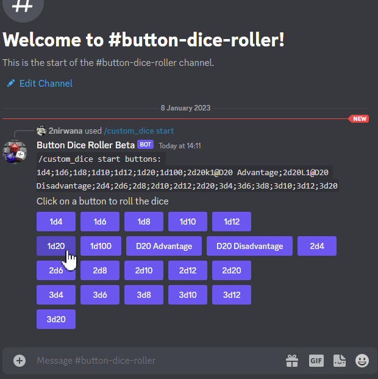
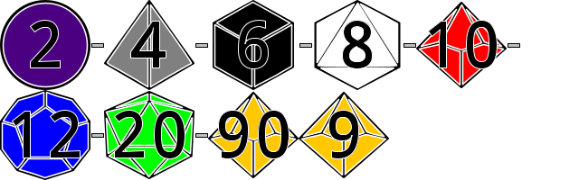

= Button Dice Roller
:toc: macro

https://www.gnu.org/licenses/agpl-3.0[image:https://img.shields.io/badge/License-AGPL_v3-blue.svg[License: AGPL v3]] https://codecov.io/gh/twonirwana/DiscordDiceBot[image:https://codecov.io/gh/twonirwana/DiscordDiceBot/branch/main/graph/badge.svg?token=OLH7L312D7[codecov]]
image:https://img.shields.io/github/actions/workflow/status/twonirwana/DiscordDiceBot/gradle.yml?branch=main[GitHub Workflow Status]
image:https://img.shields.io/discord/898657305883725834[link="https://discord.gg/e43BsqKpFr"]

This is a dice rolling bot for Discord.
The bot needs to be configured with a slash command in a channel and then provides a message with a buttons.
Upon clicking on a button the bot will post the result and move the message with the buttons to the bottom of the channel.
If the message is pined, then it will only be copied and not moved.
This allows it to roll dice without typing commands and thereby improves usability, especially for touchscreen users.
The bot supports Discord thread (the button message must be added after the thread creation), forum, Text in Voice, and it is possible to send the answer in a different channel.
It can provide images of the dice roll results and it is possible to configure channel or user specific aliases.

*Add to Discord channel by following this link*: https://discord.com/api/oauth2/authorize?client_id=812381127943782502&permissions=274878023680&scope=applications.commands%20bot[*Bot invite link*]

*Discord Server for trying the bot, questions and feature suggestions*: https://discord.gg/e43BsqKpFr[Button Dice Roller Discord Server]

*The bot need the following permission*:

* create application commands (which are needed to control the bot)
* send message and send message in threads (for the dice buttons and results)
* embed links (display of structured answers)
* attach files (add images with the dice result)
* read message history (to detect if a button message was pinned)

*If you can’t see the bots messages*: The link preview in the discord setting must be activated to see the roll results

toc::[]

== Example RPG System Commands

Some example for commands, many more systems can be mapped, please see in the detail’s description below for further options

[discrete]
=== DnD 5e
`/quickstart system:Dungeon & Dragons 5e`

or

`/custom_dice start buttons:1d4;1d6;1d8;1d10;1d12;1d20;1d100;2d20k1@D20 Advantage;2d20L1@D20 Disadvantage;2d4=@2d4;2d6=@2d6;2d8=@2d8;2d10=@2d10;2d12=@2d12;2d20=@2d20`

[discrete]
=== OSR

`/quickstart system:OSR`

or

`/custom_dice start buttons:1d20@D20;1d6@D6;2d6@2D6;1d4@D4;1d8@D8;6x3d6=@Stats;(3d6=)*10@Gold;1d100@D100;1d10@D10;1d12@D12`

[discrete]
=== Fate

`/fate start type:with_modifier`

[discrete]
=== World of Darkness

[discrete]
==== Chronicles of Darkness / nWoD

`/count_successes start dice_sides: 10 target_number: 8 reroll_set: 10`

[discrete]
==== Storyteller System / oWoD

`/pool_target start sides:10 max_dice:15 reroll_set:10 botch_set:1 reroll_variant:ask`

[discrete]
=== Shadowrun

`/count_successes start dice_sides:6 target_number:5 glitch:half_dice_one max_dice:20`

[discrete]
=== Savage Worlds:

`/custom_parameter start expression: (d!!{Dice:4@D4/6@D6/8@D8/12@D12/20@D20} + {Type: 0@Regular/1d!!6@Wildcard})k1`

[discrete]
=== Traveller

`/sum_custom_set start buttons:+2d6;+(3d6k2)@Boon;+(3d6l2)@Bane;+1d6;+1;+2;+3;+4;-1;-2;-3;-4`

[discrete]
=== Blades in the Dark

`/custom_dice start buttons: ifE(2d[0/0/0/1/1/3]l1,3,'Success',1,'Partial','Failure')@Zero;ifE(1d[0/0/0/1/1/3],3,'Success',1,'Partial','Failure')@1d6;ifG(2d[0/0/0/1/1/3]k2=,5,'Critical',2,'Success',0,'Partial','Failure')@2d6;ifG(3d[0/0/0/1/1/3]k2=,5,'Critical',2,'Success',0,'Partial','Failure')@3d6;ifG(4d[0/0/0/1/1/3]k2=,5,'Critical',2,'Success',0,'Partial','Failure')@4d6;ifG(5d[0/0/0/1/1/3]k2=,5,'Critical',2,'Success',0,'Partial','Failure')@5d6;ifG(6d[0/0/0/1/1/3]k2=,5,'Critical',2,'Success',0,'Partial','Failure')@6d6;ifG(7d[0/0/0/1/1/3]k2=,5,'Critical',2,'Success',0,'Partial','Failure')@7d6`

[discrete]
=== Call of Cthulhu (7th Edition)

`/custom_dice start buttons: 1d100; 2d100L1@1d100 Advantage; 2d100K1@1d100 Penalty; 1d3; 1d4; 1d6; 1d8; 1d10; 1d12; 1d20; 3d6`

[discrete]
=== Universal Dice Calculator ===

`/sum_custom_set start buttons: 7;8;9;+;-;4;5;6;d;k;1;2;3;0;l always_sum_result: true`

[discrete]
=== Exalted 3rd ===

`/custom_parameter start expression: val('$1', cancel(double({number of dice:1<=>24}d10,10),1,[7/8/9/10])), ifE(('$1'>=7)c,0,ifG(('$1'\<=1)c,0,'Botch'))`

[discrete]
=== Vampire 5ed ===

`/custom_parameter start expression: val('$r',{regular dice:1<=>16}d10) val('$h',{hunger dice:0<=>5}d10) val('$s',('$r'+'$h')>=6c) val('$rt','$r'==10c) val('$ht','$h'==10c) val('$ho','$h'==1c) val('$2s',((('$rt'+'$ht'=))/2)*2) val('$ts',('$s'+'$2s'=)) concat('successes: ', '$ts', ifE('$ts',0,ifG('$ho',1,' bestial failure' , ''),''), ifE('$rt' mod 2, 1, ifE('$ht' mod 2, 1, ' messy critical', ''), '')) answer_format: without_expression`

[discrete]
=== One-Roll Engine ===

`/custom_parameter start expression: groupc({Number of Dice:1<=>10}d10+({Number of Extra Die:0@0/10@1/2r10@2/3r10@3/4r10@4})>={Difficulty:1<=>10})`

[discrete]
=== Rêve de Dragon ===

`/custom_dice start buttons: 1d4@D4;1d6@D6;2d6=@2D6;1d7@D7;1d8@D8;val('roll',1d!8 col 'special') val('diceCount','roll' c) 'roll'-'diceCount'+7=@DDR;2d10=@2D10;1d12@D12;val('$r',1d12 col 'special'),if('$r'=?1,'vaisseau','$r'=?2,'sirène','$r'=?3,'faucon','$r'=?4,'couronne','$r'=?5,'dragon','$r'=?6,'épées','$r'=?7,'lyre','$r'=?8,'serpent','$r'=?9,'poisson acrobate','$r'=?10,'araignée','$r'=?11,'roseaux','$r'=?12,'château dormant')@DAS;1d20@D20;1d100@D100 answer_format: without_expression dice_image_style: polyhedral_RdD`

== Commands

All button configurations can be used with the `target_channel` option.
If this option is used then the answer of a roll will be posted in the provided channel.
The target channel must be a text channel and need the bot need the usual permissions.
If a message sends the answer to another channel, it will not be moved to the end of its own channel.

=== Quickstart

Type `/quickstart system' and the bot will offer a list of ready to play dice sets. Simple select a system out of the list or keep typing to search and filter in the list. Please let me know if you're missing an RPG system in the quickstart list.

=== Answer Format

All commands have an `answer_format` option that determines how the answer of a dice roll is shown.
In the case of the direct roll command `r` the `answer_format` can be configured for the current channel with the `channel_config` command.
There are the following options: `full`,`without_expression`, `compact` and `minimal`.

==== Full

`full` is the default and shows result as multiline with avatar of the user, color coding and all details.
Will show result images, if they are configured.

==== Without expression

`without_expression` is the same as `full` but don't show the dice expression in the result.
This is useful if the expression is very long and it is recommended to add a label.
Will show result images, if they are configured.

==== Only Dice

`only_dice` shows only dice results, if configured as images.
The expression, static modifier and calculated results beside the dice will not be shown.

==== Compact

`compact` shows the result as single line (if there are multiple expressions in on roll, they will be displayed in multiple lines) and all details.
Will not show result images, even if they are configured.

==== Minimal

`minimal` shows the result as single line with only the expression (or the if available instant of the expression the label) and result, without the details like the result of each die.
Will not show result images, even if they are configured.

=== Dice Images

The `custom_dice`, `sum_custom_dice` and `custom_parameter` commands have a `dice_image_style` and a `dice_image_color` option that can be configured to add an image of the rolled dice.
The color of specific dice can be overwritten, with valid colors for the style, in the expression.
For example:

`/custom_dice start buttons: 2d6+2d10 col 'red_and_gold' + 2d20 col 'green_and_gold'@color roll answer_format: without_expression dice_image_style: polyhedral_alies_v2 dice_image_color: blue_and_gold`

produces:

For the direct rolls it can be configured with the `channel_config` command.
The images will only be shown if the following conditions are met:

* The `answer_format` is set to `full` or `without_expression`
* No set of dice with more than 15 dice
* Not more the 10 sets of dice
* No multi line result

There are the following options:

==== none

No image will be shown.

==== polyhedral_3d

image:image/3d_red_and_white.png[image,600]

Valid for d4, d6, d10, d8, d12, d20, d100 and the only supported color is: `red_and_white`

==== fate

Valid for d[-1,1,1] and the only supported color is: `black`

==== d6_dots

image:image/d6White.png[image,360]

Valid for d6 and the only supported color is: `white`

==== polyhedral_2d

Valid for d4, d6, d10, d8, d12, d20, d100 and the supported colors are: `white`, `gray`, `black`, `red`, `pink`, `orange`, `yellow`, `green`, `magenta`, `cyan`, `blue`.

==== polyhedral_alies_v1

Valid for d4, d6, d10, d8, d12, d20, d100 and the only supported color is: `black_and_gold`
This set was designed and contributed by https://www.instagram.com/alie_in_beanland/[alieinbeanland].

==== polyhedral_alies_v2

Valid for d4, d6, d10, d8, d12, d20, d100 and supported colors are: `black_and_gold`, `blue_and_silver`, `blue_and_gold`, `green_and_gold`, `orange_and_silver`, `red_and_gold`, `purple_and_silver`

.black_and_gold
image:image/polyhedral_black_and_gold_v2.png[image,600]

.blue_and_silver

.green_and_gold

.red_and_gold

.blue_and_gold
image:image/polyhedral_blue_and_gold.png[image,600]

.orange_and_silver
image:image/polyhedral_orange_and_silver.png[image,600]

.purple_and_silver
image:image/polyhedral_purple_and_silver.png[image,600]

This set was designed and contributed by https://www.instagram.com/alie_in_beanland/[alieinbeanland].

==== polyhedral_knots

.blue

.purple_dark

.purple_white

Valid for d4, d6, d10, d8, d12, d20, d100 and the supported color is: `blue`, `purple_dark` and `purple_white`

This set was designed and contributed by mailto:minuette@gmail.com[Myrynvalona].

==== polyhedral_RdD

.default

.special

The style has two "colors": `default` and `special`. The `default` "color" contains universal images for d4, d6, d7, d10, d8, d12, d20, d100.
The `special` "color" contains only images for Draconic d8 (image values are 0 to 7 and a dragon for the 8) and Astral d12 with only special symbols.

This set was designed and contributed by http://scriptarium.org[scriptarium.org].

=== Custom Dice Buttons

image:image/custom_dice.webp[image]

Use the slash command: `custom_dice start` and add up to 25 custom buttons, each with its own dice expression (see the section <<Dice Expression Notation>>).
The expressions for the buttons are seperated by `;`.
For example `/custom_dice start buttons:3d6@Attack;10d10;3d20` will produce three buttons, one with `3d6` (and the label Attack), one with `10d10` and one with `3d20`.
Clicking on a button provides the results of the button dice expression.

It is possible to use alias with custom dice buttons.
The alias must be created before the button is created.
A usage example would be:
Create the server alias `attack modifier` with the value 0.
Then create a custom dice button with the expression `d20+attack modifier@Attack` and each player create a user alias for `attack modifier` with the attack modifier of its character.
This will provide a button called `Attack` which rolls with a personalized modifier for each player.

=== Direct Roll

With the command `/r` it is possible to directly call the dice expression (see <<Dice Expression Notation>>) without the usage of buttons.
For example `/r expression:3d6` will simply roll 3d6 and post the result without showing any buttons.
The result of the dice will be summed up per default.
The output can be configured with the `channel_config` command.

=== Channel Config

This command is used create a channel specific configuration.
It is possible to configure alias and the output for the direct rolls:

==== Direct Roll Config

The command can be configured for a channel by using the `/channel_config save_direct_roll_config` command.
The configuration will be used for all `/r` in this channel until it is overwritten or deleted with `/channel_config delete_direct_roll_config`.

There are the following options:

* `answer_format`: see the  <<Answer Format>> for details, the default value is `full`.
* `always_sum_result`: if the result should always sum together.
If set to false the `3d6` would return the result for each die, not the sum of all three.
This can still be done by using the sum operator `=` e.g. `3d6=`.
The default value is true
* `image_result`: see <<Dice Images>> for details, the default value is `polyhedral_3d_red_and_white`

==== Aliases

It is possible to configure alias in a channel.
Alias can be used with direct roll and custom dice.
If a custom dice button is created that should use an alias, the alias musst exist before the button is created.

For example `/channel_config user_channel_alias save name: att value: (2d20k1)+10+1d4` creates an attack alias for the user.
Each time the user uses the slash command `/r expression: att`, the `att` will automatically replaced with `(2d20k1)+10+1d4`

An alias has a name and a value and will replace each occurrence in the dice expression of its name with its value.
There are two types of alias, channel alias and user channel alias.
A channel alias will be applied to each roll in a channel, for every user.
The user channel alias will only apply to for the user who created the alias in the channel.
The user channel alias will be applied first.
Three are four commands for each type.

* `save` creates or overwrites an alias
* `multi_save` creates or overwrites multiple alias.
Alias are seperated by `;` and the name and the value are seperated by `:`.
For example: `/channel_config channel_alias multi_save aliases: att:2d20;dmg:2d6+4=` saves two alias:
** `att` with `2d20`
** `dmg` with `2d6+4=`
* `delete` removes an alias by its name
* `list` provides a list of all alias

=== Count success in a pool

image:image/count_successes.webp[image]

Use the slash command: `/count_successes start`.
You need to provide the sides of the dice, the target number, optional a glitch system as parameter and the number of buttons.
For example `/count_successes start dice_sides: 12 target_number: 7 glitch: half_dice_one max_dice: 10 min_dice_count: 2 reroll_set: 11,12 botch_set: 1,2,3` creates 10 (from 2d12 to 11d12) buttons for 12 sided dice that roll against the target of 7.
The dice side 11 and 12 will be rerolled and the result 1,2 or 3 will remove a success.
By clicking on a button a number of dice will be rolled and the count of the dice with results equal or approve the target number returned.

==== Glitch Option

As default there is no glitch option (special handling of ones), but it is possible to configure one of the following options:

===== half_dice_one

The option `half_dice_one` will mark the result as glitch if more than half of the dice show 1. This is for example used in the Shadowrun dice system.

===== count_ones

The option `count_ones` will only mark and count the ones in the result but will not change the number of successes.

==== Number of Dice

The optional parameter `max_dice` will change the max number of dice (and thereby the number of buttons).
The default value is 15, which will be used if the parameter is not set, and the max number of dice is 25.

==== Minimal dice count

The count successes command provides per default buttons for 1 to `max_dice` count dice buttons.
If `min_dice_count` is used then the bot will start with a higher number of dice.
For example `dice_sides: 6`, `dice_sides:max_dice: 5` and `min_dice_count: 10` will result in the buttons: 10d6, 11d6, 12d6, 13d6, 14d6

==== Reroll Set

The optional parameter `reroll_set` provide the sides of the die that should be rerolled.
Multiple numbers can be given comma seperated.

==== Botch Set

The optional parameter `botch_set` provide the sides of the die that negate successes.
Multiple numbers can be given comma seperated.

=== Fate

image:image/fate.webp[image]

Use the slash command: `/fate start type:with_modifier` or `/fate start type:simple` to get buttons for Fate.
There are two types simple and with modifier.

=== Sum Dice Set

Use the slash command `/sum_dice_set start` to create a message to create a die set.
The user can click on the + and - buttons to add dice to the set.
Clicking on the `Roll` button will roll the dice the message and copy a clear button message to the end.

=== Hold Reroll

image:image/hold_reroll.webp[image]

Use the slash command `/hold_reroll start sides:6 reroll_set:2,3,4 success_set:5,6 failure_set:1` to create a message for the hold reroll system.
The system has the following parameter:

* `sides`: The sides of the dice
* `reroll_set`: The number on the dice that can be rerolled.
Multiple numbers can be given comma seperated.
* `success_set`: The number on the dice that are counted as success.
Multiple numbers can be given comma seperated.
* `failure_set`: The number on the dice that are counted as failure.
Multiple numbers can be given comma seperated.

If the roll has numbers that are in the reroll set than the user has the option to reroll, finish or clear the result.

* Reroll will reroll all results in the reroll set and keep the remaining unchanged.
* Finish will fix the current result and allow a new roll.
* Clear will remove the current result and allow a new roll.

=== Pool Target

Use the command `/pool_target start sides:<sidesOfDie> max_dice:<maxDiceInPool> reroll_set:<numbersThatCanBeRerolled> botch_set:<numbersThatAreSubractedFromTheSuccesses> reroll_variant:<rerollVariant>` to create a message for the pool target system.
The system will first ask the user to select the pool size, then the target number and then, depending on the configuration, if dice should be rerolled.
Each dice result bigger or equal of the target number is a success.
If a botch set is configured then the number of dice results that are in the botch set will be subtracted from the successes.
If a reroll is configured then all dice results that are in the reroll set will rerolled and the new results added to total results.

The system has the following parameter:

* `sides`: The sides of the dice, e.g. 10 for a pool that uses d10.
* `max_dice`: The max number of dice in the pool, limited to and default is 15
* `reroll_set`: The number on the dice that can be rerolled.
Multiple numbers can be given comma seperated.
* `botch_set`: The number on the dice that remove successes.
Multiple numbers can be given comma seperated.
* `reroll_variant`: The default option `always` will always reroll all dice results in the reroll set.
The option `ask` will ask the user each time if the reroll should be done.

Please let me know if another system is needed.

=== Sum Custom Set

Use the slash command `/sum_custom_set start buttons:+1d6;+1d20;+1@Boon;-1@Bane` to create a message with a custom dice set.
In this case it will create four buttons: `1d6`,`1d20`,`+1@Boon` and `-1@Bane`.
The buttons can be created with the dice notation, see the section <<Dice Expression Notation>> and are seperated by `;`.
The text after an optional `@` will be used as label for the button.
The user can click on a button to add it to the set, even multiple times.
The first user that clicks on a button add his name to the message and only this user can add, remove or roll dice.
Every user can still use the `Clear` button.
Clicking on the `Roll` button will roll the dice the message and copy a clear button message to the end.
The `Roll` can only be clicked if the expression is valid. `Back` will undo the last addition and `Clear` reset all.
If the option `always_sum_result` is true (the default) then the result of the dice will be added together, the equivalent of adding `=` at the end of the expression.

This command can also use alias (see the `channel_config` command).
The substitution of the alias name with its value happen upon pressing the `Roll` button.
If there is no valid alias then the expression can be invalid and it is not possible to press the `Roll` button.

=== Custom Parameter

Use for example the slash command `/custom_parameter expression:{numberOfDice:1\<\=>10}d{sides:4@D4/6@D6/8@D8/12@D12/20@D20}` to create a message with a dice expression, where the user can fill the parameter with buttons.
For the dice expression see the section <<Dice Expression Notation>>.
The parameter have the format `+{name}+`.
If there is no range given, then button for the values 1-15 are presented.
There are two parameter range notations:

* `{numberOfDice:1\<\=>10}`: Provides the buttons for the given range (including).
The maximum are 23 buttons.
* `{sides:4/6/8/10/12/20}`: Provides each value, seperated be a slash up to 23 buttons.
It is possible to add an optional label to each value in the format `value@label`.
For example `{bonus:0@None/3@Small Bonus/5@Big Bonus}` will show on the buttons 'None', 'Small Bonus' and 'Big Bonus' but apply the values 0, 3 or 5 to the expression

An expression can have up to 4 parameter.
The user can click on the buttons to fill all open parameter of the expression.
If all parameter are selected then the expression will be rolled.
The first user that clicks on a button add his name to the message and only this user can select further parameter.
Every user can still use the `Clear` button.
The command uses the `without_expression` as default answer format.

=== Clear Command

The clear command removes all button configuration in a channel from the bot and deletes the button messages.

=== Validation Command

This command can be used to develop new expressions and get a fast feedback if the expression has the correct syntax.
Upon typing the autocomplete will be open and show the typed expression if it has a valid syntax and can be executed.
If the expression is invalid it will show the first 100 characters of the error message.
To get the complete error message press enter twice (even if the autocomplete will replace the expression with the error text).
The autocomplete validation will not apply alias.
This command will change when discord improves the autocomplete.

== Dice Expression Notation

see https://github.com/twonirwana/DiceEvaluator for all details.

The evaluator processes dice expression and returns a list of rolls, each containing a list of elements.
Elements have a value (a number or a text) and can have a color.
For example `2d6` rolls two six-sided dice and returns a list with two elements, each with a value between 1 and 6. To get the sum of the roll, simple add a `=` at the end, for example in this case `2d6=`.
The same applies to numbers `3 + 5` has as result a list with the elements 3 and 5, only if written as `3 + 5=` the result is 8.
All non-functional text must be surrounded (escaped) by `'`. For example `1d('head' + 'tail')` will flip a coin.
List can be included into the expression by using brackets.
For example `1d[2,2,4,4,6,6]` will a die which has two sides with 2, two sides with 4 and two sides with 6. The roll will be a list with one element, which has a value of 2, 4 or 6. Lists also escape characters, so `1d[head,tail]` will also flip a coin.

Multiple expression can be separated by `,`.
For example `3d6, 4d8` will roll two six-sided dice and return a list with two rolls, the first one containing the roll elements of the `3d6` and the second one the roll of the `4d8`.

Operators have a precedent, which is defined by the order of the operators in the table below.
Operators with a higher precedence are evaluated first.
Brackets can be used to change the order of evaluation.
For example `1d4+3d6` is the appending of roll of 1d4 and 3d6, but `(1d4+3=)d6)` gets first the sum of the roll of 1d4 and 3 and then rolls this number of d6.

The number of dice is limited to 1000 and every number approve 10 digits or with more than 10 digit after the decimal dot result in an error.

Boolean values will be represented by `'true'` and `'false'`.

It is possible to set tags and color.
Colors have no direct effect and will be also set to all random elements of the expression.
Tags on the other hand wil change the interaction of with other operators, in most cases operators will work only on elements with the same tag.

=== Operators

All operators are case insensitiv.

[width="100%",cols="9%,8%,7%,48%,4%,8%,8%,8%",options="header",]
|===
|Name |Notation |Example |Description |Precedent |Associativity |Left parameter |Right parameter
|Repeat |`<number>x<expression>` |`3x2d6` |Repeats the expression separately a number of times given in <number>. This should be used outside other expressions and will not work inside most expressions |0 |left |a single integer number between 1-10 | a expression
|List Repeat |`<number>r<expression>` |`3r(2d6=)` |Repeats the expression a number of times given in <number> and combines the results in one list. |1 |left |a single integer number between 0-10 | a expression
|Or |`<boolean>\|\|<boolean>` |`d6=?5 \|\| d6=?6` | Boolean or operation of the two boolean values | 2 |left | boolean value | boolean value
|And |`<boolean>&&<boolean>` |`d6=?5 && d6=?6` | Boolean and operation of the two boolean values | 3 |left | boolean value | boolean value
|And |`!<boolean>` |`!d6=?5` | Negates the boolean value right from it | 4 |right |  | boolean value
|Equal |`<left> =? <right>` |`d6=?5` | Compare the left and the right and returns true if equal and false otherwise | 5 |left |one or more elements  | one or more elements
|Lesser |`<left> <? <right>` |`d6<?5` | Compare the left and the right and returns true if `<left>` is lesser than `<right>` otherwise false | 6 |left |a single number | a single number
|Lesser Equal |`<left> <=? <right>` |`d6<=?5` | Compare the left and the right and returns true if `<left>` is lesser or equal then `<right>` otherwise false | 7 |left |a single number | a single number
|Greater |`<left> >? <right>` |`d6>?5` | Compare the left and the right and returns true if `<left>` is greater than `<right>` otherwise false | 8 |left |a single number | a single number
|Greater Equal |`<left> >=? <right>` |`d6>=?5` | Compare the left and the right and returns true if `<left>` is greater or equal than `<right>` otherwise false | 9 |left |a single number | a single number
| In |`<left> in <right>` |`d6 in [1/3/5]` | Returns true if every element in left is contained in right otherwise false | 10 |left |a one or more elements | one or more elements
|Sum |`<left> =` |`2d6=` |Sums the list of on the left side of the symbol |11 |left |a list of numbers |-
|Modulo |`<left> mod <right>` |`d6 mod 2` | returns the remainder of the division |12 |left |a single integer number |a single non zero integer number
|Multiply |`<left> * <right>` |`2 * 6` |Multiplies the right number with the left number |13|left |a single number |a single number
|Divide |`<left> / <right>` |`4 / 2` |Divides the right number with the left number and rounds down to the next full number |14 |left |a single integer number |a single integer number
|Decimal Divide |`<left> // <right>` |`4 / 2` |Divides the right number with the left number and provides a decimal number with up to 5 decimal digital |15 |left |a single number |a single number
|Count |`<list> c` |`3d6>3c` |Counts the number of elements in a list |16 |left |a list |-
|Greater Then Filter |`<list> > <number>` |`3d6>3` |Keeps only the elements of the left list that are bigger as the right number. Applies only to elements with the same tag. |17 |left |one or more numbers |a single number
|Lesser Then Filter |`<list> < <number>` |`3d6<3` |Keeps only the elements of the left list that are lesser as the right number. Applies only to elements with the same tag. |18 |left |one or more numbers |a single number
|Greater Equal Then Filter |`<list> >= <number>` |`3d6>=3` |Keeps only the elements of the left list that are bigger or equal as the right number. Applies only to elements with the same tag. |19 |left |one or more numbers |a single number
|Lesser Equal Then Filter |`<list> \<= <number>` |`3d6\<=3` |Keeps only the elements of the left list that are lesser or equal as the right number. Applies only to elements with the same tag. |20 |left |one or more numbers |a single number
|Equal Filter |`<list> == <element>` |`3d6==3` |Keeps only the elements of the left list that are equal to the element. Applies only to elements with the same tag. |21 |left |one or more elements |a single elements
|Keep Highest |`<list> k <numberToKept>` |`3d6k2` |keeps the highest values out a list, like the roll of multiple dice. Applies only to elements with the same tag. |22 |left |one or more elements |a single number
|Keep Lowest |`<list> l <numberToKept>` |`3d6l2` |keeps the lowest values out a list, like the roll of multiple dice. Applies only to elements with the same tag. |23 |left |one or more elements |a single number
|Appending |`<left> + <right>` |`2d6 + 2` or `+3` |Combines the rolls of both sides to a single list. If used as unary operator, it will be ignored e.g. `+5` will process to `5` |24 (max for unary) |left for binary and right for unary |none or more elements |one or more elements
|Negative Appending |`<left> - <right>` |`2 - 1` or `-d6` |Combines the rolls of both sides to a single list. The right side is multiplied by -1. |25 |left for binary and right for unary |none or more elements |one or more numbers
|Reroll |`<expression>rr<rerollIfIn>` |`10d6rr1` | Reroll the whole `<expression>` once if any of the elements of `<expression>` are in the elements of `<rerollIfIn>` |26 |left|one or more elements|one or more elements
|Tag |`<expression>tag<text>` |`d6 tag 'special'` | Set a tag to all elements of an expression, most operator work on elements with the same tag. The tag will be appended to the name but a number remains a number, even with a text tag. |27 |left|one or more elements|a single text
|Color |`<expression>col<text>` |`d6 col 'red'` | Set a color to all elements, and all in it involved random elements, of an expression. The color will not directly given in the result and has no effect on other operations |28 |left|one or more elements|a single text
|Exploding Add Dice |`<numberOfDice>d!!<numberOfFaces>` |`3d!!6` |Throws dice and any time the max value of a die is rolled, that die is re-rolled and added to the die previous resul total. A roll of the reroll the sum of the value. |29 |left for binary and right for unary |none or a single positiv integer number (max 1000) |a single integer number
|Exploding Dice |`<numberOfDice>d!<numberOfFaces>` |`4d!6` or `d!6` |Throws dice and any time the max value of a die is rolled, that die is re-rolled and added to the dice set total. A reroll will be represented as two dice roll elements |30 |left for binary and right for unary |none or a single integer number (max 1000) |a single positiv integer number
|Regular Dice |`<numberOfDice>d<numberOfFaces>` |`3d20`, `d20` or `3d[2/4/8]` |Throws a number of dice given by the left number. The number sides are given by the right number. If the right side a list, an element of the list is randomly picked. The roll is a list with the dice throw |31 |left for binary and right for unary |none or a single integer number (max 1000) |a single positiv number or multiple elements
|===

=== Functions

All functions are case insensitiv.

[width="100%",cols="6%,22%,14%,58%",options="header",]
|===
|Name |Notation |Example |Description
|min |`min(<expression1>, <expression2> ...)` |`min(4d6)` |returns the smallest elements (multiple if the smallest is not unique) of one or more inner expressions. Text is compared alphabetically
|max |`max(<expression1>, <expression2> ...)` |`max(4d6)` |returns the smallest elements (multiple if the smallest is not unique) of one or more inner expressions. Text is compared alphabetically
|sort asc |`asc(<expression1>, <expression2> ...)` |`asc(4d6)` |sorts all elements ascending of one or more inner expressions. Text is compared alphabetically
|sort desc |`desc(<expression1>, <expression2> ...)` |`desc(4d6)` |sorts all elements descending of one or more inner expressions. Text is compared alphabetically
|sort desc |`desc(<expression1>, <expression2> ...)` |`desc(4d6)` |sorts all elements descending of one or more inner expressions. Text is compared alphabetically
|chancel |`chancel(<expression>, <listA>, <listB>)` |`chancel(8d10, 10, 1)` |the elements of listA and listB (can also be single elements) chancel each other and remove each other from the result.
|replace |`replace(<expression>, <find>, <replace>)` |`replace(8d10, [9/10], 'bonus')` | each element in `<expression>` that matches on of the elements in `<find>` will be replaced with the elements in `<replace>`.
|if |`if(<boolean>,<true>,<false>)` |`if(1d6=?6,'six','not six')` or `ifE(1d6=?6,'six')` or `val('$r',1d6), if('$r'=?1,'one','$r'=?2,'two','else') |if `<boolean>` equal true then return the `<true>` expression or else the `<false>` expression. The `<false>` expression is optional, if it is missing and the elements are not equal, the result empty. It is possible to add more than `<boolean>,<true>` pair in the function, the result will be the `<true>` of the first true `<boolean>`, coming from left.
|if equal (deprecated by if) |`ifE(<expression>,<compareTo>,<true>,<false>)` |`ifE(1d6,6,'six','not six')` or `ifE(1d6,6,'six')` or `ifE(1d6,6,'six',5,'five','else')` |compares the elements of `<expression>` and `<compareTo>` and if they are equal return the `<true>` expression or else the `<false>` expression. The `<false>` expression is optional, if it is missing and the elements are not equal, the result will be the input expression. It is possible to add more than `<compareTo>,<true>` pair in the function, the result will be the `<true>` of the first, coming from left, matching `<compareTo>`.
|if in (deprecated by if) |`ifIn(<expression>,<compareTo>,<true>,<false>)` |`ifIn(1d6,[1/6],'1or6','2-5')` or `ifIn(1d6,[1/6],'1or6')` or `ifIn(1d6,[1/6],'up',[2/5],'down',`middle`)` | returns `<true>` expression if the element of `<expression>` is in `<compareTo>` or else the `<false>` expression. `<expression>` musst provide a single element. The `<false>` expression is optional, if it is missing and the elements are not equal, the result will be the input expression. It is possible to add more than `<compareTo>,<true>` pair in the function, the result will be the `<true>` of the first, coming from left, matching `<compareTo>`.
|if greater (deprecated by if) |`ifG(<expression>,<compareTo>,<true>,<false>)` |`ifG(1d6,4,'high','low')` or `ifG(1d6,4,'high')` or `ifG(1d6,4,'high',2,'mid','low')` |compares the elements of `<expression>` and `<compareTo>` and if `<expression>` is greater than `<compareTo>` then return the `<true>` expression or else the `<false>` expression. The `<false>` expression is optional, if it is missing and the elements are not equal, the result will be the input expression. It is possible to add more than `<compareTo>,<true>` pair in the function, the result will be the `<true>` of the first, coming from left, matching `<compareTo>`. `<expression>` and `<compareTo>` need to have a single element as result.
|if lesser (deprecated by if) |`ifL(<expression>,<compareTo>,<true>,<false>)` |`ifL(1d6,3,'low','high')` or `ifL(1d6,3,'low')` or `ifL(1d6,5,'mid',3,'low','high')`|compares the elements of `<expression>` and `<compareTo>` and if `<expression>` is lesser than `<compareTo>` then return the `<true>` expression or else the `<false>` expression. The `<false>` expression is optional, if it is missing and the elements are not equal, the result will be the input expression. It is possible to add more than `<compareTo>,<true>` pair in the function, the result will be the `<true>` of the first, coming from left, matching `<compareTo>`. `<expression>` and `<compareTo>` need to have a single element as result.
|group count |`groupC(<expression1>, <expression2> ...)` |`groupC(20d6)` | counts all elements of with the same value and provides the results as list in the format of `<count>x<value>`
|concatenate  |`concat(<expression1>, <expression2> ...)` |`concat('Attack: ', 2d20, ' Damage:', 3d6+5=)` | Joining all expressions together to a single result.
|value |`val(<valueName>, <value>)` |`val('$1',6d6), '$1'=, ('$1'>4)c` | Defining a value (that get evaluated once) that can be used in multiple times in the same expression. The value name must be surrounded by two `'`. For example `val('$1',6d6), '$1'=, ('$1'>4)c` would define the result of `6d6` as `'$1'`. Therefore `'$1'=` would provide the sum and `('$1'>4)c` the count of dice with a value greater than 4 of the same dice throw.
|===

== Contributors

* Special thank to https://www.instagram.com/alie_in_beanland/[alieinbeanland] for the design of the dice images for `polyhedral_alies_v1` and `polyhedral_alies_v2`
* Special thank to mailto:minuette@gmail.com[Myrynvalona] for the design of the dice images for `polyhedral_knots`
* Special thank to http://scriptarium.org[scriptarium.org] for creating the dice images for `polyhedral_RdD`
* The `polyhedral_3d` dice images where adapted from https://blendswap.com/blend/16634
* The `d6_dot` dice images are from https://game-icons.net/
