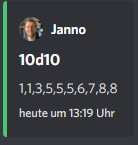
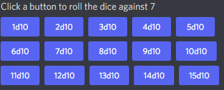
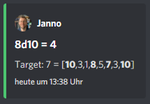
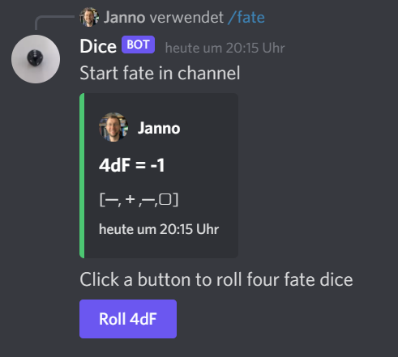

# DiscordDiceBot

A dice rolling bot for Discord. The bot needs to be configured in each channel and then provides a button selection.
Upon clicking on a button the bot will post the result and move the buttons to the bottom of the channel.

Add to Discord channel by following this link:
https://discord.com/api/oauth2/authorize?client_id=812381127943782502&permissions=67584&scope=bot%20applications.commands

:warning: **If you are using mobile browser**: The link preview in the discord setting must be activated to see the roll
results

The bot has currently three systems:

## Custom dice buttons

Use the slash command: 'custom_dice start' and add up to 15 buttons in the format XdY where X is the number of dice and
Y the number of sides of each die (max value of each is 99). For example '/custom_dice start 1_button: 3d6 2_button:
10d10 3_button:3d20' produces the following buttons:

and on clicking the ordered results of the button dice:

## Count success in a pool

Use the slash command: '/count_successes start'. You need to provide the sides of the dice and the target number as
parameter. For example '/count_successes start dice_sides:10 target_number:7' creates 15 buttons for 10 sided dice that
roll against the target of 7. By clicking on a button a number of dice will be rolled and the count of the dice with
results equal or approve the target number returned. This is a system that can be used for example for the new Word of
Darkness (sides:
10, target 7) or Shadowrun (sides: 6, target 4).

## Fate

Use the slash command: '/fate start' to active the fate system. There are two types simple and with modifier:

### Simple

### With modifier buttons

Please let me know if another system is needed.
