

# Button Dice Roller

This is dice rolling bot for Discord. The bot needs to be configured with a slash command in a channel and then provides
a message with a button selection. Upon clicking on a button the bot will post the result and move the message with the
buttons to the bottom of the channel. If the message is pined, then it will only be copied and not moved. This allows it
to roll dice without typing commands and thereby improves usability, especially for touchscreen users.

Add to Discord channel by following this link:
[Bot invite link](https://discord.com/api/oauth2/authorize?client_id=812381127943782502&permissions=18432&scope=bot%20applications.commands)

For questions and suggestions join me at the [Button Dice Roller Discord Server](https://discord.gg/e43BsqKpFr)

The bot need permission to create application commands (which are needed to control the bot), send message and embed
links (for the dice buttons and results).

:warning: **If you can't see the bots messages**: The link preview in the discord setting must be activated to see the
roll results

## Example RPG System Commands

Some example for commands, many more systems can be mapped with commands, please see in the detail's description below
for further options

### DnD 5e

`/custom_dice start 1_button:1d4 2_button:1d6 3_button:1d8 4_button:1d10 5_button:1d12 6_button:1d20 7_button:1d100 8_button:2d20k1@D20 Advantage 9_button:2d20L1@D20 Disdvantage 10_button:2d4 11_button:2d6 12_button:2d8 13_button:2d10 14_button:2d12 15_button:2d20 16_button:3d4 17_button:3d6 18_button:3d8 19_button:3d10 20_button:3d12 21_button:3d20 22_button:4d4 23_button:4d6 24_button:4d8 25_button:4d10`

### OSR

`/custom_dice start 1_button:1d20@D20 2_button:1d6@D6 3_button:2d6@2D6 4_button:1d4@D4 5_button:1d8@D8 6_button:6x[3d6]
@Stats 7_button:3d6*10@Gold 8_button:1d100@D100 9_button:1d10@D10 10_button:1d12@D12`

### Fate

`/fate start type:with_modifier`

### World of Darkness

#### Chronicles of Darkness / nWoD

`/count_successes start dice_sides:10 target_number:8`

#### Storyteller System / oWoD

`/pool_target start sides:10 max_dice:15 reroll_set:10 botch_set:1 reroll_variant:ask`

### Shadowrun

`/count_successes start dice_sides:6 target_number:5 glitch:half_dice_one max_dice:20`

The bot has currently the following systems:

## Commands

### Custom dice buttons

Use the slash command: `custom_dice start` and add up to 25 custom buttons, each with its own dice expression. For
example `/custom_dice start 1_button:3d6 2_button:10d10 3_button:3d20` produces the three buttons as follows:

and on clicking on a button provides the results of the button dice and result of the expression (default it is the sum
of all dice):

#### Dice Expression Notation

Each button can be set with dice expression with the following notation.

| Name                          | Notation                                            | Example       | Description                                                                                                      |
|-------------------------------|-----------------------------------------------------|---------------|------------------------------------------------------------------------------------------------------------------|
|                               |                                                     |               |                                                                                                                  |
| Single Die                    | `d<numberOfFaces>`                                  | `d6`          | roll one, six-sided die                                                                                          |
| Multiple Dice                 | `<numberOfDice>d<numberOfFaces>`                    | `3d20`        | roll three, twenty-sided dice                                                                                    |
| Keep Dice                     | `<numberOfDice>d<numberOfFaces>k<numberOfDiceKept>` | `3d6k2`       | keeps the the highest values out of three, six-sided dice                                                        |
| Keep Low Dice                 | `<numberOfDice>d<numberOfFaces>l<numberOfDiceKept>` | `3d6l2`       | keeps the the lowest values out of three, six-sided dice                                                         |
| Multiply Die                  | `d<numberOfFaces>X`                                 | `d10X`        | multiplies the result of `d10 * d10`                                                                             |
| Multiply Dice                 | `<numberOfDice>d<numberOfFaces>X`                   | `2d10X`       | multiplies the result of `2d10 * 2d10`                                                                           |
| Fudge Dice                    | `dF`                                                | `dF`          | rolls a single "fudge" die (a six sided die, 1/3 chance of `-1`, 1/3 chance of `0`, and 1/3 chance of `1`)       |
| Multiple Fudge Dice           | `<numberOfDice>dF`                                  | `3dF`         | rolls multiple fudge dice                                                                                        |
| Weighted Fudge Die            | `dF.<weight>`                                       | `dF.1`        | A weighted fudge die with 1/6 chance of a `1`, `2/3` chance of a `0` and 1/6 chance of a `-1`                    |
| Multiple Weighted Fudge Dice  | `<numberOfDice>dF.<weight>`                         | `2dF.1`       | multiple weighted fudge dice.                                                                                    |
| Exploding Dice                | `<numberOfDice>d<numberOfFaces>!`                   | `4d6!`        | any time the max value of a die is rolled, that die is re-rolled and added to the total                          |
| Exploding Dice (Target)       | `<numberOfDice>d<numberOfFaces>!><target>`          | `3d6!>5`      | Same as exploding dice, but re-roll on values greater than or equal to the target (note, less than works too)    |
| Compounding Dice              | `<numberOfDice>d<numberOfFaces>!!`                  | `3d6!!`       | similar to exploding dice, but ALL dice are re-rolled                                                            | 
| Compounding Dice (Target)     | `<numberOfDice>d<numberOfFaces>!!><target>`         | `3d6!!>5`     | similar as exploding dice (target), but all dice are re-rolled and added.                                        |
| Target Pool Dice              | `<numberOfDice>d<numberOfFaces>[>,<,=]<target>`     | `3d6=6`       | counts the number of dice that match the target (NOTE: greater & less than also match equals, i.e `>=` and `<=`) | 
| Target Pool Dice (Expression) | `(<expression>)[>,<,=]<target>`                     | `(4d8-2)>6`   | A target pool roll, but where the expression is evaluated to the target.                                         |
| Multiple Rolls                | `<numberOfRolls>x[<expression>]`                    | `3x[3d6]`     | Rolls the inner expressions multiple time and returning each result, without combining them.                     |
| Label                         | `<expression>@label`                                | `1d20@Attack` | If the expression is used with a button, the button gets the given label                                         |
| Integer                       | `<int>`                                             | `42`          | typically used in math operations, i.e. `2d4+2`                                                                  |
| Math                          | `<left> <operation> <right>`                        |
| Add                           | `<left> + <right>`                                  | `2d6 + 2`     |                                                                                                                  |
| Subtract                      | `<left> - <right>`                                  | `2 - 1`       |                                                                                                                  |
| Multiply                      | `<left> * <right>`                                  | `1d4 * 2d6`   |                                                                                                                  |
| Divide                        | `<left> / <right>`                                  | `4 / 2`       |                                                                                                                  |

see https://github.com/diceroll-dev/dice-parser for more details.

### Direct Roll

With the command `/r` it is possible to directly call the dice expression (see 'Dice Expression Notation') without the
usage of buttons. For example '/r 3d6' will simply roll 3d6 and post the result without showing any buttons.

### Count success in a pool

Use the slash command: `/count_successes start`. You need to provide the sides of the dice, the target number, optional
a glitch system as parameter and the number of buttons. For example `/count_successes start dice_sides:10 target_number:
7` creates 15 buttons for 10 sided dice that roll against the target of 7. By clicking on a button a number of dice will
be rolled and the count of the dice with results equal or approve the target number returned.

#### Glitch Option

As default there is no glitch option (special handling of ones) but it is possible to configure one of the following
options:

##### half_dice_one

The option `half_dice_one` will mark the result as glitch if more than half of the dice show 1. This is for example used
in the Shadowrun dice system.

##### count_ones

The option 'count_ones' will only mark and count the ones in the result but will not change the number of successes.

##### subtract_ones

The option 'subtract_ones' will subtract the number of ones in the roll from the number of successes. If there are more
ons than successes the result will be negative. This is for example used in the old World of Darkness dice system.

#### Number of Dice Option

The optional parameter `max_dice` will change the max number of dice (and thereby the number of buttons). The default
value is 15, which will be used if the parameter is not set, and the max number of dice is 25.

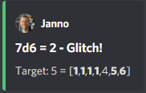

### Fate

Use the slash command: `/fate start type:with_modifier` or `/fate start type:simple` to get buttons for Fate. There are
two types simple and with modifier:

#### Simple

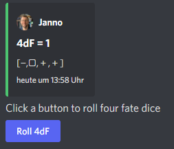

#### With modifier buttons

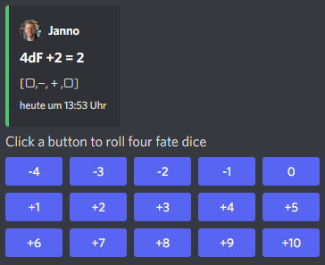

### Sum Dice Set

Use the slash command `/sum_dice_set start` to create a message to create a die set. The user can click on the + and -
buttons to add dice to the set. Clicking on the `Roll` button will roll the dice the message and copy a clear button
message to the end.

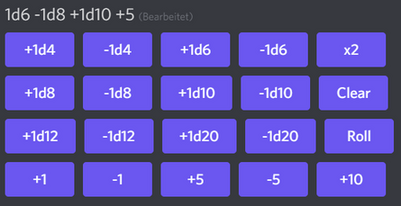

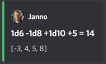

### Hold Reroll

Use the slash command `/hold_reroll start sides:6 reroll_set:2,3,4 success_set:5,6 failure_set:1` to create a message
for the hold reroll system. The system has the following parameter:

- `sides`: The sides of the dice
- `reroll_set`: The number on the dice that can be rerolled. Multiple numbers can be given comma seperated.
- `success_set`: The number on the dice that are counted as success. Multiple numbers can be given comma seperated.
- `failure_set`: The number on the dice that are counted as failure. Multiple numbers can be given comma seperated.

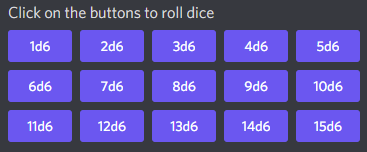

If the roll has numbers that are in the reroll set than the user has the option to reroll, finish or clear the result.

- Reroll will reroll all results in the reroll set and keep the remaining unchanged.
- Finish will fix the current result and allow a new roll.
- Clear will remove the current result and allow a new roll.

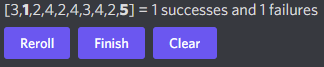

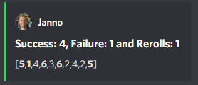

### Pool Target

Use the
command `/pool_target start sides:<sidesOfDie> max_dice:<maxDiceInPool> reroll_set:<numbersThatCanBeRerolled> botch_set:<numbersThatAreSubractedFromTheSuccesses> reroll_variant:<rerollVariant>`
to create a message for the pool target system. The system will first ask the user to select the pool size, then the
target number and then, depending on the configuration, if dice should be rerolled. Each dice result bigger or equal of
the target number is a success. If a botch set is configured then the number of dice results that are in the botch set
will be subtracted from the successes. If a reroll is configured then all dice results that are in the reroll set will
rerolled and the new results added to total results.

The system has the following parameter:

- `sides`: The sides of the dice, e.g. 10 for a pool that uses d10.
- `max_dice`: The max number of dice in the pool, limited to 25 and default is 15
- `reroll_set`: The number on the dice that can be rerolled. Multiple numbers can be given comma seperated.
- `botch_set`: The number on the dice that remove successes. Multiple numbers can be given comma seperated.
- `reroll_variant`: The default option `always` will always reroll all dice results in the reroll set. The option `ask`
  will ask the user each time if the reroll should be done.

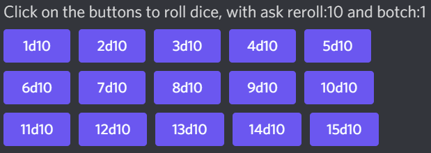

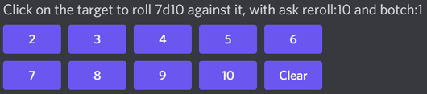

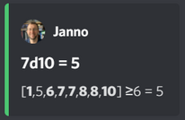

Please let me know if another system is needed.
