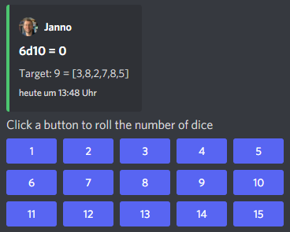

# DiscordDiceBot

A dice rolling bot for Discord. The bot needs to be configured in each channel and then provides a button selection.
Upon clicking on a button the bot will post the result and move the buttons to the bottom of the channel.

Add to Discord channel by following this link:
https://discord.com/api/oauth2/authorize?client_id=812381127943782502&permissions=67584&scope=bot%20applications.commands

The bot has currently two systems:

## Count Success in a pool

Add the bot to the channel and use the slash command: '/count_successes start'. You need to provide the sides of the dice and the
target number as parameter. By clicking on a button a number of dice will be rolled and the count of the dice with
results equal or approve the target number returned. This is a system that can be used for example for the new Word of
Darkness (sides: 10, target 7) or Shadowrun (sides: 6, target 4).

## Fate

Add the bot to the channel and use the slash command: '/fate start' to active the fate system.

Please let me know if another system is needed.
